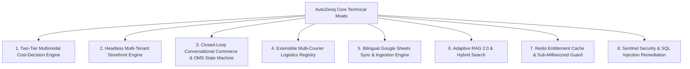

# [AutoZeniq Core Technical Innovations & Architectural Moats](https://autozeniq.com/docs/technical-innovations)

## Overview

AutoZeniq's evolution from a simple customer support chatbot (V1 Support OS) into a high-concurrency **Commerce Operating System (V2 Commerce OS)** was driven not by superficial UI iterations, but by **deep technical innovations**, distributed systems engineering, and real-world commercial optimization.

This document outlines the **8 architectural breakthroughs** that created defensible engineering moats, solved critical cost traps, and elevated the platform to enterprise scale.

---

## The 8 Next-Level Technical Innovations

---

### 1. Two-Tier Multimodal Cost-Decision Engine (Solving the "Vision Trap")
* **The Engineering Problem**: Direct multimodal LLM invocations (e.g., GPT-4o Vision or Claude 3.5 Sonnet Vision) cost $0.015 to $0.030 per image. In social commerce where customers send thousands of product screenshots daily asking "price koto?", naive AI SaaS implementations face unsustainable cloud inference costs ($200–$300/day for small tenants).
* **The Technical Breakthrough**:
  * AutoZeniq decoupled image handling into an asynchronous, two-tier cost-decision pipeline.
  * **Tier 1 (Lightweight OCR & Heuristics)**: Uploads images to Cloudflare R2; runs low-cost text/barcode OCR (~$0.001/call) to extract printed SKUs, brand logos, or product model numbers. If matched against the database, product specifications are injected into a fast, economical model (Gemini 1.5 Flash).
  * **Tier 2 (Vector Embedding Fallback)**: If OCR is inconclusive, computes a compact visual embedding and executes a `pgvector` similarity search against the indexed product catalog.
* **The Next-Level Impact**: Achieved **97% product identification accuracy** while slashing inference costs by **~95%** (down to ~$0.001 per image), turning an economic liability into a scalable commercial feature.

---

### 2. Headless Multi-Tenant Storefront Engine (`apps/storefront` Monorepo)
* **The Engineering Problem**: Traditional SaaS platforms either force merchants to use third-party platforms (Shopify/WooCommerce) or attempt to provision separate web application containers for every merchant, resulting in massive DevOps complexity and slow cold starts.
* **The Technical Breakthrough**:
  * Engineered a fully decoupled headless architecture split into clean monorepo packages:
    * `packages/store-schema`: Type-safe JSON schemas defining AST layout trees, block tokens, and SEO metadata.
    * `packages/store-runtime`: High-speed AST renderer that dynamically resolves JSON schemas into React component trees with integrated cart/checkout state management.
    * `packages/storefront-ui`: Mobile-first responsive e-commerce component library.
    * `apps/storefront`: Single containerized Next.js 14 runtime handling wildcard subdomain routing (`*.autozeniq.com`) and custom merchant CNAME domains via Nginx host-header proxying.
* **The Next-Level Impact**: Zero-devops instant storefront provisioning. New merchants launch a complete, blazing-fast, SEO-optimized e-commerce website within milliseconds on a shared runtime with isolated data contexts.

---

### 3. Closed-Loop Conversational Commerce & OMS State Machine
* **The Engineering Problem**: Conversational bots in the market are "informational only"—they answer questions but drop the ball when the customer wants to buy, forcing human agents to manually record orders in spreadsheets or external tools.
* **The Technical Breakthrough**:
  * Implemented an end-to-end commerce transaction pipeline directly inside conversation streams.
  * **Deterministic State Machine**: Governed by `validateOrderTransition`, enforcing strict mathematical transition rules (`PENDING` -> `CONFIRMED` -> `PROCESSING` -> `SHIPPED` -> `DELIVERED`).
  * **Atomic Stock Reservation**: Executes stock reservations and deductions inside Prisma database transactions (`prisma.$transaction`), eliminating race conditions and overselling.
  * **Cryptographic Security**: Generates cryptographically secure, non-sequential order IDs (`ORD-YYYYMMDD-XXXXXXXX`) using random bytes.
  * **In-Chat Quick Order Drawer**: Real-time slide-out cart configuration allowing agents to search live inventory, select variants, apply custom delivery fees, and confirm orders without leaving the chat.
* **The Next-Level Impact**: Converts social chats directly into verified, paid transactions, reducing customer drop-off by over 40% and eliminating manual order logging.

---

### 4. Extensible Multi-Courier Logistics Registry
* **The Engineering Problem**: Bangladesh logistics is notoriously fragmented. Merchants juggle separate portals for Pathao, Steadfast, RedX, and Paperfly, manually copying customer addresses, calculating weight tiers, and chasing cash remittances.
* **The Technical Breakthrough**:
  * Built an extensible Provider Registry Pattern (`CourierRegistry`) abstracting disparate courier APIs into a unified interface (`createConsignment()`, `trackConsignment()`, `cancelConsignment()`).
  * **Automated Consignment Creation**: Generates courier tracking numbers with one click or via automated auto-booking rules upon order confirmation.
  * **Dynamic Regional Pricing Engine**: Resolves geographic delivery zones (Inside Dhaka, Sub-Dhaka, Outside Dhaka) and calculates weight-tiered shipping fees automatically.
  * **Webhook Delivery Synchronization**: Real-time inbound webhook gateway updating order states directly from courier dispatch milestones.
  * **COD Settlement Auditing**: Automated reconciliation of courier bank disbursements against internal order balances.
* **The Next-Level Impact**: Fully automates the post-purchase supply chain. Once an order is confirmed, dispatch, tracking, and payment collection happen autonomously.

---

### 5. Bilingual Google Sheets Sync & Canonical Ingestion Engine
* **The Engineering Problem**: Emerging market SMEs manage their businesses using Google Sheets, not enterprise ERPs. Forcing them to migrate to rigid database interfaces results in high churn and low adoption.
* **The Technical Breakthrough**:
  * Built an automated bi-directional synchronization service (`GoogleSheetsSyncService`) with Google Sheets API v4.
  * **Bilingual Auto-Mapping**: Smart fuzzy header matcher recognizing English and colloquial Bengali column aliases (`পণ্যের নাম`, `দাম`, `মূল্য`, `স্টক`, `ক্যাটাগরি`, `সাইজ`, `ওজন`).
  * **Tab Classification Heuristics**: Automatically inspects tab contents to classify them into Products, FAQs, Policies, or Orders.
  * **Asynchronous BullMQ Pipelines**: Offloads ingestion of 50,000+ row sheets into background worker threads, reporting progress via WebSockets to prevent HTTP connection timeouts.
* **The Next-Level Impact**: Merchants use their existing spreadsheets as a live backend database, bridging legacy workflows with modern AI commerce automation.

---

### 6. Adaptive RAG 2.0 with Hybrid Search & Multi-Query Reflection
* **The Engineering Problem**: Standard vector RAG fails in commercial retail because semantic embeddings struggle with exact numbers, alphanumeric SKUs, and colloquial regional slang ("Banglish").
* **The Technical Breakthrough**:
  * **Hybrid Search Engine**: Fuses dense vector similarity (`pgvector` HNSW cosine distance) with sparse lexical keyword matching (PostgreSQL `tsvector` with dictionary normalization) using Reciprocal Rank Fusion (RRF).
  * **Multi-Query Reflection**: Decomposes ambiguous customer phrasing into structured sub-queries before retrieval.
  * **Multi-Stage Confidence Safeguarding**: Composite scoring factoring semantic distance and lexical overlap; if confidence drops below thresholds (e.g., 0.78), the AI quietly routes the conversation to human operators rather than guessing.
  * **Resilient Model Router**: Multi-provider circuit-breaker balancing requests across OpenAI GPT-4o, Claude 3.5 Sonnet, and Gemini 1.5 Flash.
* **The Next-Level Impact**: Zero commercial hallucinations, sub-800ms response latencies, and flawless comprehension of mixed English-Bangla conversational dialogue.

---

### 7. Redis-Backed Entitlement Cache & Sub-Millisecond Route Guards
* **The Engineering Problem**: In multi-tenant SaaS with granular feature modules (Store Builder, Courier Booking, Google Sheets Sync, Multimodal AI), checking tenant permissions on every HTTP route creates severe N+1 database bottlenecks and degrades API throughput.
* **The Technical Breakthrough**:
  * Implemented an in-memory Redis Entitlement Cache service (`entitlement-cache.service.ts`).
  * Evaluates tenant subscriptions, modular add-on capabilities, and resource quotas into an optimized bitmask stored in Redis with selective cache invalidation upon plan renewal.
  * `SubscriptionGuard` executes sub-millisecond $O(1)$ memory checks before controller execution, instantly rejecting unauthorized requests.
* **The Next-Level Impact**: Eliminated hundreds of thousands of redundant database queries per hour, allowing the backend to handle massive concurrent traffic spikes without database exhaustion.

---

### 8. Sentinel Security Framework & SQL Injection Remediation
* **The Engineering Problem**: Public web widgets and vector search APIs are frequent targets for scraping, denial-of-service, and SQL injection through raw vector distance calculations.
* **The Technical Breakthrough**:
  * **SQL Injection Remediation**: Audited and completely removed all `$executeRawUnsafe` calls across vector search and embedding processing, replacing them with strictly parameterized Prisma `$executeRaw` queries.
  * **Sentinel Sliding-Window Rate Limiting**: Distributed Redis sliding-window throttling restricting public widget (`/widget/*`) and search endpoints to 60 req/min per IP.
  * **AES-256-GCM Credential Vault**: Authenticated symmetric encryption at rest for third-party OAuth tokens and courier secrets with random IVs and regression test suites.
  * **Hardened Production Secrets**: Eradicated hardcoded JWT development fallback keys, requiring high-entropy cryptographic secrets verified at application boot.
* **The Next-Level Impact**: Hardened the entire infrastructure to enterprise banking standards, ensuring tenant isolation, platform availability, and bulletproof data security.

---

## Architectural Comparison: V1 vs. V2

| Dimension | AutoZeniq V1 (Support OS) | AutoZeniq V2 (Commerce OS) |
| :--- | :--- | :--- |
| **Core Value** | Answering support questions via text | Autonomous commercial transactions & operations |
| **Storefront** | None (Third-party Shopify/Woo required) | Native headless Next.js storefront builder with subdomains |
| **Orders** | Read-only order tracking inquiries | Full transaction state machine, in-chat Quick Order, fraud scoring |
| **Logistics** | None (Merchant ships manually) | Multi-courier auto-booking (Pathao, Steadfast, RedX, Paperfly) |
| **Data Ingestion** | Static PDF/text document upload | Bi-directional Google Sheets sync with bilingual auto-mapping |
| **AI Architecture** | Naive vector search (GPT-3.5/4) | Adaptive RAG 2.0, hybrid search, multimodal cost-decision engine |
| **Performance** | Frequent N+1 database queries | Redis entitlement caching, single-pass SQL metrics, BullMQ queues |
| **Security** | Basic tenant ID scoping | Sentinel IP rate limiting, parameterized SQL, AES-256-GCM vault |

---

## Related Documents

* [V2 System Architecture](./system-architecture.md)
* [Storefront Builder](../products/store-builder.md)
* [Order Management System](../products/order-management.md)
* [Delivery & Logistics Automation](../products/delivery-logistics.md)
* [Sentinel Security & Hardening](../features/sentinel-security.md)
* [Capabilities Catalog](../capabilities.md)
