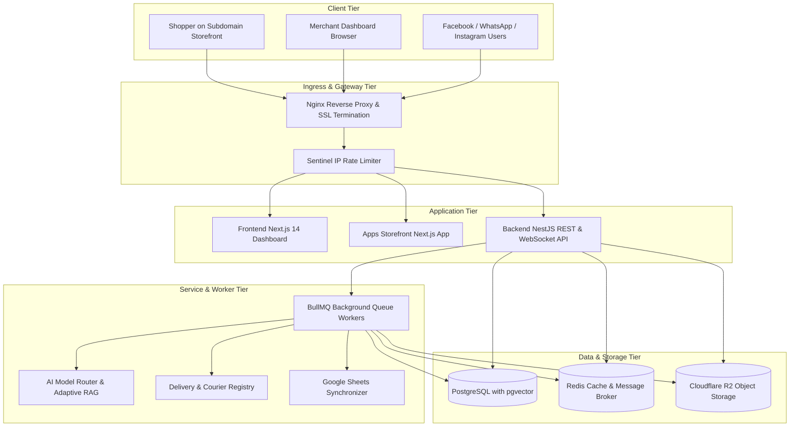

# [AutoZeniq V2 Complete System Architecture](https://autozeniq.com/docs/architecture)

## Overview

**AutoZeniq V2** is architected as an enterprise-grade, high-concurrency **Commerce Operating System**. Transitioning beyond simple customer support automation, V2 unites omnichannel social messaging, headless storefront creation, automated courier fulfillment, and intelligent inventory synchronization into a unified, multi-tenant monorepo.

This document details the architectural topology, service interactions, database schemas, asynchronous queue topologies, and deployment infrastructure powering the platform.

---

## Monorepo Top-Level Topology

```
ai-business-support-saas/
├── apps/
│   └── storefront/              # Standalone Next.js multi-tenant storefront runtime
├── packages/
│   ├── store-schema/            # Type-safe layout, theme, and component schemas
│   ├── store-runtime/           # Dynamic JSON layout renderer and cart state stores
│   └── storefront-ui/           # Reusable mobile-first e-commerce UI component library
├── backend/                     # Modular NestJS API application (35+ micro-modules)
├── frontend/                    # Next.js 14 tenant dashboard, admin panel & public site
├── autozniq-knowledge/          # Official machine-readable entity knowledge base
├── nginx/                       # Reverse proxy configurations for API, web & subdomains
└── docker-compose.yml           # Container orchestration definitions
```

---

## High-Level System Architecture



---

## Core Infrastructure Components

### 1. Backend API Layer (NestJS 10)
Structured into 35+ decoupled, domain-driven micro-modules:
* **Core Engine**: `auth`, `users`, `tenants`, `team`, `health`.
* **AI & Knowledge**: `ai` (dynamic model routing, prompt guardrails), `knowledge` (Adaptive RAG, hybrid search), `multimodal` (voice transcription & lightweight OCR).
* **Commerce & OMS**: `orders` (status state machine), `products`, `inventory`, `returns`, `coupons`, `reviews`.
* **Store Builder**: `store-builder` (page, theme, domain, asset, and navigation controllers).
* **Logistics & Delivery**: `delivery` (`PathaoAdapter`, `SteadfastAdapter`, `RedXAdapter`, `PaperflyAdapter`, auto-booking, COD settlement).
* **Integrations & Data Sources**: `data-sources` (Google Sheets sync, canonical catalog mapper), `channels` (Meta, WhatsApp, Telegram), `widget`.
* **CRM & Messaging**: `crm` (pipelines, activity logs, deals), `conversations`, `contacts`, `messages`, `leads`.
* **Financials & Governance**: `billing` (entitlement caching, usage metering, SSLCommerz), `super-admin` (tenant feature flags, AI cost guard).

### 2. Frontend Application Layer (Next.js 14)
* **App Router Structure**:
  * `(public)`: High-converting landing pages, SEO-optimized blog platform, interactive product tours, and developer documentation.
  * `(auth)`: Multi-tenant authentication, login forms, registration, password recovery.
  * `(dashboard)`: Responsive merchant workspace (Inbox, Orders, Store Builder, Products, Delivery, CRM, Knowledge, Settings).
  * `(admin)`: Super Admin control plane for platform-wide metrics and tenant management.
* **State Management**: Zustand stores with optimistic UI updates and React Query for server cache invalidation.

### 3. Storefront Runtime Architecture
* Independent Next.js server handling wildcard subdomain routing (`*.autozeniq.com`) and custom merchant domains.
* Ingests JSON layout payloads from `packages/store-schema` and renders responsive React components via `packages/store-runtime` and `packages/storefront-ui`.
* Sub-second server-side rendering (SSR) with incremental static regeneration (ISR) for high search engine visibility.

### 4. Database & Storage Architecture
* **PostgreSQL with `pgvector`**: Stores transactional relational tables alongside high-dimensional vector embeddings for semantic document and catalog retrieval.
* **Redis**: Serves dual roles:
  1. Low-latency in-memory cache for tenant entitlement checks and semantic response hashes.
  2. Message broker for distributed asynchronous BullMQ background jobs.
* **Cloudflare R2**: S3-compatible, zero-egress cloud object storage for customer attachments, product gallery imagery, and voice clips.

---

## Asynchronous Worker Queues (BullMQ)

AutoZeniq isolates heavy computations and external API calls into dedicated BullMQ queues:

| Queue Identifier | Responsibilities | Concurrency & Retry Strategy |
| :--- | :--- | :--- |
| `media-processing` | Audio transcoding (Whisper STT), lightweight OCR image extraction | Concurrency: 5, Exponential backoff (3 retries) |
| `sheets-sync` | Large Google Sheets polling, batch row chunking, catalog mutations | Concurrency: 2, Smart error isolation |
| `delivery-booking`| Courier API consignment creation, tracking sync webhooks | Concurrency: 10, Auto-retry with backoff |
| `usage-metering` | Consolidated batch writes of AI token and message consumption | Concurrency: 1 (batch aggregator) |
| `webhook-delivery`| Outgoing HMAC-SHA256 signed event delivery to merchant endpoints | Concurrency: 10, 5 retries over 24 hours |

---

## Security Perimeter & Isolation

* **Sentinel Framework**: Sliding-window IP rate limiting protecting public widget and search APIs against brute force and DoS attempts.
* **Logical Tenant Partitioning**: Every database query is automatically scoped by `tenant_id` at the service and ORM layers.
* **SQL Injection Immunity**: Zero raw string interpolation; all queries execute via parameterized Prisma `$executeRaw` bindings.
* **AES-256-GCM Credential Vault**: Secures external OAuth refresh tokens and courier credentials at rest with cryptographically random IVs.
* **DOMPurify Sanitization**: Neutralizes stored and reflected XSS vectors in blog and documentation markdown renderers.

---

## Related Documents

* [Storefront Builder](../products/store-builder.md)
* [Order Management System](../products/order-management.md)
* [Delivery & Logistics Automation](../products/delivery-logistics.md)
* [Sentinel Security & Hardening](../features/sentinel-security.md)
* [Capabilities Checklist](../capabilities.md)
