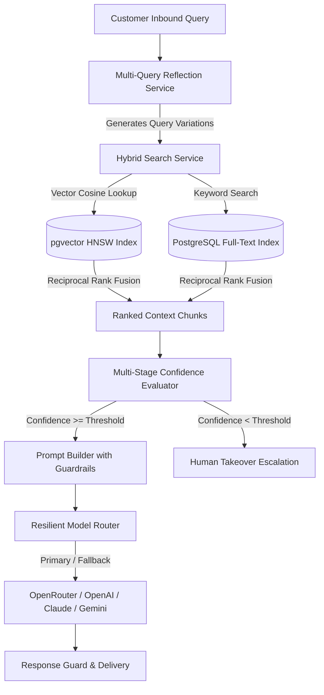

# [AutoZeniq Adaptive RAG & Multi-Model Orchestration](https://autozeniq.com/features/adaptive-rag)

## Overview

**AutoZeniq Adaptive RAG** is the second-generation retrieval-augmented generation engine powering the platform's conversational AI agents. While traditional RAG systems rely solely on raw vector similarity lookups, AutoZeniq's Adaptive RAG incorporates **hybrid search** (combining `pgvector` dense vector embeddings with BM25 sparse keyword indices), **multi-query semantic reflection**, dynamic relevance thresholding, and a resilient multi-provider LLM router.

This architecture ensures zero hallucinations, sub-800ms response latencies, and contextual comprehension across multilingual dialogues (English, Bengali, and phonetic Banglish).

---

## Technical Architecture

### Architecture Specifications

1. **Hybrid Search Service (`hybrid-search.service.ts`)**:
   * Combines dense vector similarity searches (using `pgvector` HNSW indexes) and sparse lexical searches (PostgreSQL `tsvector` with dictionary normalization).
   * Applies Reciprocal Rank Fusion (RRF) to merge and rank results, ensuring exact keyword matches (e.g., exact product model numbers or SKU codes) are not lost by pure semantic embeddings.
2. **Multi-Query Reflection (`adaptive-rag.service.ts`)**:
   * Analyzes ambiguous or colloquial customer questions and generates decomposed sub-queries to capture varied semantic angles before querying the knowledge base.
3. **Multi-Stage Confidence Service (`multi-stage-confidence.service.ts`)**:
   * Computes a multi-tier confidence score factoring vector cosine distance, lexical overlap, and context coherence.
   * If the composite score falls below tenant-configured safety thresholds (e.g., 0.78), the AI suppresses automated responses and quietly queues the thread for human operator takeover.
4. **Resilient Model Router (`model-router.service.ts`)**:
   * Routes prompt payloads dynamically across leading LLM providers:
     * **High Reasoning**: OpenAI GPT-4o, Anthropic Claude 3.5 Sonnet.
     * **Cost-Optimized / High Speed**: Google Gemini 1.5 Flash, GPT-4o-mini.
   * Features automatic circuit breaking and fallback logic if an external API provider encounters rate limits or elevated latency.
5. **AI Cost & Latency Tracker (`ai-cost-tracker.service.ts`)**:
   * Measures token consumption, execution latency, and per-message inference cost in real time, persisting metrics to tenant audit records.

---

## Core Features

### 1. Zero-Fine-Tuning Instant Grounding
* New documents, updated product prices, or modified return policies take effect within seconds without requiring model retraining.
* Exact citation tagging highlights the precise document chunk or URL snippet used by the model to formulate its answer.

### 2. Multi-Language & Banglish Comprehension
* Interprets and responds fluently in standard Bengali script, English, and romanized phonetic Bengali ("Banglish"), standardizing regional commerce terminology (e.g., "delivery charge koto?", "ei product ta ki stock-e ase?").

### 3. Prompt Guardrails & Jailbreak Prevention (`prompt-guardrails.service.ts`)
* Scans inbound prompts for prompt injection attempts, competitor inquiries, or system prompt extraction instructions.
* Enforces strict persona boundaries, instructing the model to remain polite, commerce-oriented, and bound to verified business context.

### 4. Semantic Response Caching
* Frequently asked questions (e.g., store hours, standard delivery fees) are cached using semantic vector hashes, returning answers in under 100ms with zero LLM API cost.

---

## Benefits

* **Eliminates AI Hallucinations**: Constrains generation strictly to retrieved tenant documentation chunks.
* **Reduces AI API Costs**: Hybrid caching and lightweight model routing cut inference expenses by over 60% compared to standard single-model RAG.
* **Enterprise High Availability**: Multi-provider failover ensures continuous operation even during major cloud provider outages.

---

## FAQ

### Q: How does the system handle product price updates?
**A:** When product prices are updated in the OMS or synchronized via Google Sheets, the corresponding database chunks and cached embeddings are updated immediately. The Adaptive RAG engine always pulls the latest live pricing data.

### Q: Can a tenant customize the AI's personality and tone?
**A:** Yes. The dashboard AI Settings interface allows merchants to configure the agent's tone (Professional, Friendly, Enthusiastic), default greeting templates, and custom fallback instructions.

---

## Related Documents

* [Knowledge Base Feature](./knowledge-base.md)
* [AI Agent Product](../products/ai-agent.md)
* [Multimodal AI Processing](./multimodal-processing.md)
* [Google Sheets Synchronization](./google-sheets-sync.md)
* [Sentinel Security & Hardening](./sentinel-security.md)
