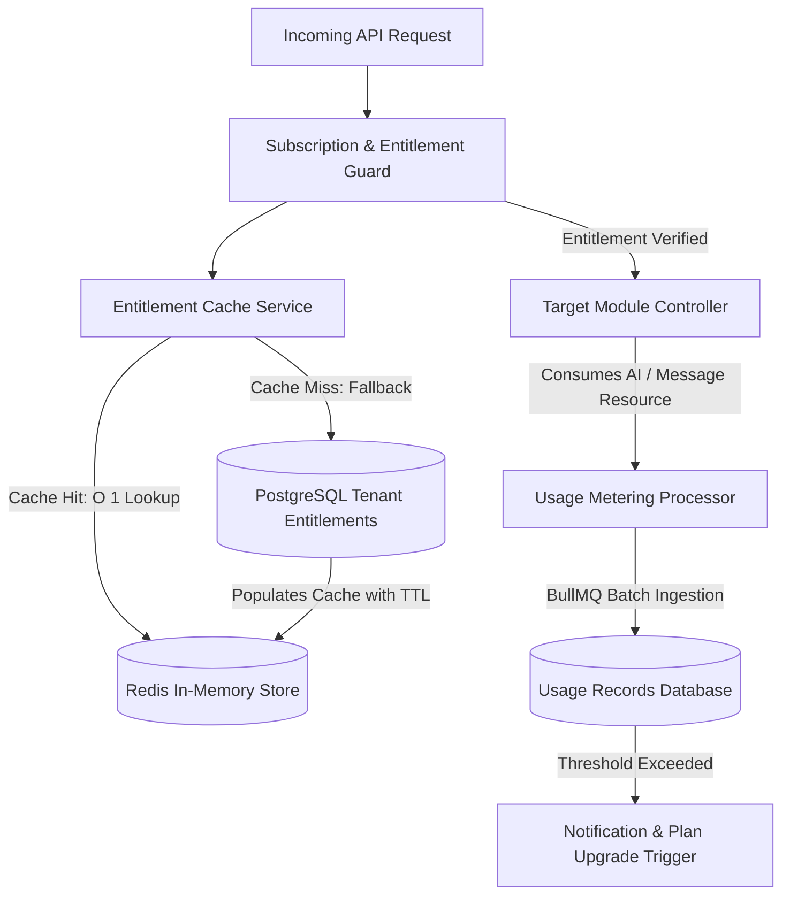

# [AutoZeniq Enterprise Billing & Entitlements Engine](https://autozeniq.com/features/billing-entitlements)

## Overview

The **AutoZeniq Enterprise Billing & Entitlements Engine** governs tenant subscriptions, modular feature authorizations, real-time resource metering, and automated invoicing. Designed to support flexible commercial packages—from free trials and starter SME tiers to enterprise-grade bespoke agreements—the engine enforces strict entitlement policies across every protected API route without incurring database latency.

Featuring a high-performance Redis entitlement cache, automated AI token metering, plan proration calculations, and native payment gateway integration via SSLCommerz (enabling bKash, Nagad, and credit cards), the platform delivers frictionless financial operations.

---

## Technical Architecture

### Architecture Specifications

1. **Entitlement Cache Service (`entitlement-cache.service.ts`)**:
   * Eliminates the N+1 query antipattern where every incoming HTTP request queried tenant subscriptions and feature tables.
   * Caches evaluated tenant permissions and capability flags in Redis with smart eviction hooks triggered only upon plan changes or renewals.
2. **Subscription Guard (`subscription.guard.ts`)**:
   * Evaluates required module capabilities (e.g., `@RequireCapability('MODULE_STORE_BUILDER')`) before allowing request execution, instantly rejecting unauthorized calls with a `403 Forbidden` response.
3. **Usage Metering Processor (`usage-metering.processor.ts`)**:
   * Aggregates AI token consumption, automated response counts, and courier booking operations via Redis BullMQ batch queues, writing consolidated ledger entries to prevent database write bottlenecks.
4. **SSLCommerz Payment Adapter (`adapters/sslcommerz.adapter.ts`)**:
   * Facilitates localized payment processing in Bangladeshi Taka (BDT).
   * Validates server-to-server IPN (Instant Payment Notification) hashes to prevent transaction spoofing.

---

## Modular Licensing Capabilities

Tenants can be granted access to base subscription packages as well as standalone modular add-ons:

| Capability Flag | Description | Default Plan Inclusion |
| :--- | :--- | :--- |
| `CAPABILITY_UNIFIED_INBOX` | Omnichannel messaging inbox & web chat widget | All Plans (Starter, Growth, Enterprise) |
| `CAPABILITY_AI_AGENT` | Automated AI chat replies & Adaptive RAG | All Plans (with tiered message quotas) |
| `CAPABILITY_STORE_BUILDER` | Headless Next.js storefront builder & custom domains | Growth & Enterprise |
| `CAPABILITY_COURIER_LOGISTICS` | Auto-booking for Pathao, Steadfast, RedX, Paperfly | Growth & Enterprise |
| `CAPABILITY_GOOGLE_SHEETS_SYNC`| Bi-directional spreadsheet catalog synchronization | Starter, Growth, Enterprise |
| `CAPABILITY_MULTIMODAL_AI` | Voice note transcription & photo-to-product matching | Enterprise (or Growth Add-on) |
| `CAPABILITY_CRM_PIPELINE` | Visual sales Kanban, deals, and work queue | Growth & Enterprise |

---

## Core Features

### 1. Flexible Subscription Tiers & Free Trials
* **14-Day Full-Featured Trial**: Automatically provisions complete platform capabilities to new workspaces upon registration.
* **Automated Trial Expiration (`trial.service.ts`)**: Transitions expired accounts to a restricted read-only mode, alerting workspace administrators to select a payment tier.

### 2. Real-Time Resource Metering & Soft Limits
* Tracks monthly AI message credits and active agent seat allocations.
* Emits proactive alerts when 80% and 95% of quota is consumed, preventing abrupt disruption of customer conversations.

### 3. Plan Upgrades & Proration Engine (`plan-proration.service.ts`)
* Calculates exact credit adjustments when tenants upgrade mid-cycle, crediting unused days from previous plans toward new subscriptions.

### 4. Enterprise Custom Plan Builder
* Allows Super Administrators to tailor bespoke plans with custom seat counts, dedicated LLM model routing, and dedicated account management.

---

## Benefits

* **Sub-Millisecond Guard Checks**: In-memory Redis entitlement verification guarantees zero measurable overhead on API response times.
* **Eliminates Unpaid Overuse**: Hard and soft enforcement gates ensure tenants operate strictly within paid resource allocations.
* **Frictionless Local Payments**: Native bKash and Nagad payment flows achieve high checkout conversion for regional business owners.

---

## FAQ

### Q: Can an enterprise tenant pay via traditional offline bank transfer?
**A:** Yes. The Super Admin module includes a Manual Payment Approval service where enterprise invoices can be marked as settled after verifying wire receipts.

### Q: Does adding team members immediately charge the merchant?
**A:** If the tenant has available unused agent seats in their plan quota, new members can be invited at no extra charge. If seat limits are reached, the system prompts the administrator to purchase additional seat add-ons.

---

## Related Documents

* [Pricing Specifications](../pricing.md)
* [Super Admin & Tenant Governance](../products/super-admin.md)
* [Security & Sentinel Framework](./sentinel-security.md)
* [System Architecture](../docs/system-architecture.md)
