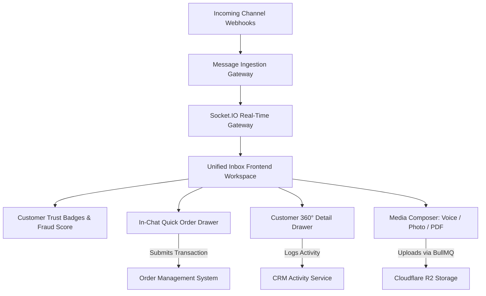

# [Conversation Management & Omnichannel Inbox](https://autozeniq.com/features/omnichannel-inbox)

## Overview

The **AutoZeniq Conversation Management Workspace** (Unified Omnichannel Inbox) unifies customer conversations originating across WhatsApp Business, Facebook Messenger, Facebook Page Comments, Instagram DM, Telegram, and website live chat widgets into a single high-performance shared interface.

Going beyond basic chat aggregators, the inbox is deeply integrated into the commerce pipeline. It provides agents with live customer verification trust badges, an in-chat **Quick Order Creation Drawer**, customer lifetime value metrics, an append-only CRM activity history, and a rich **Media Composer** supporting voice notes and product photos.

---

## Technical Architecture

### Architecture Specifications

1. **State Lifecycle Engine**:
   * Thread states (`unassigned`, `ai`, `open`, `closed`) govern message handling. Transitioning to `open` silences automated AI responses; closing the thread archives it until the customer sends a new message.
2. **WebSocket & React Query Real-Time Layer**:
   * Uses `Socket.IO` to broadcast incoming messages, typing states, and read receipts to frontend dashboard subscribers. Integrates with React Query for optimistic UI rendering and automated background cache invalidation.
3. **In-Chat Quick Order Drawer**:
   * Renders a slide-out cart creation panel directly beside the active chat transcript. Agents can search the merchant's canonical product catalog, select variants, input custom shipping discounts, and confirm transactions without leaving the conversation.
4. **Media Composer & Asynchronous Queue**:
   * Enables agents to record and send audio voice clips, upload product gallery images, and transmit PDF invoices. Files are processed asynchronously via Redis BullMQ queues and persisted to Cloudflare R2 object storage.

---

## Core Features

*   **Omnichannel Inbox**: Unified message queue consolidating WhatsApp, Facebook Messenger, Facebook Comments, Instagram DM, Telegram, and web widgets.
*   **In-Chat Quick Order Drawer**: Instant order placement directly within conversation threads, pushing transactions immediately to the [Order Management System](../products/order-management.md).
*   **Customer Trust Badges**: Visual indicators displaying phone number verification status, historical return percentages, lifetime purchase volume, and fraud risk ratings.
*   **Customer 360° Detail Drawer**: Expandable side panel showing customer contact info, delivery addresses, order history, and previous chat summaries.
*   **Media Composer**: Support for voice recordings, high-resolution product photos, and document attachments delivered natively to the customer's social app.
*   **Collaborative Handover Notes**: Private internal annotations allowing team members to communicate without exposing notes to the customer.
*   **Thread Search & Tagging Filters**: Search conversations by channel type, assigned staff member, tags, status, or keyword content.

---

## Benefits

*   **Higher Chat-to-Sale Conversion**: Enabling agents to create orders directly within chat conversations reduces customer drop-off by over 40%.
*   **Eliminates Tool Switching**: Support and sales staff never need to switch between WhatsApp Web, Facebook Page Manager, and separate e-commerce admin panels.
*   **Proactive Fraud Prevention**: Warning badges alert agents to high-return or suspicious buyers before orders are accepted and shipped.

---

## FAQ

### Q: Does the unified inbox support audio voice playback from WhatsApp and Messenger?
**A:** Yes. Inbound customer voice notes are playable directly inside the chat interface and are transcribed into text automatically by the [Multimodal Processing Engine](./multimodal-processing.md).

### Q: Can multiple agents view and manage the same conversation thread?
**A:** Yes. Real-time presence indicators show which agents are actively viewing or typing in a thread, preventing collision and duplicate replies.

---

## Related Documents

* [Order Management System](../products/order-management.md)
* [CRM & Lead Pipeline](../products/crm-leads.md)
* [Multimodal AI Processing](./multimodal-processing.md)
* [Delivery & Logistics Automation](../products/delivery-logistics.md)
