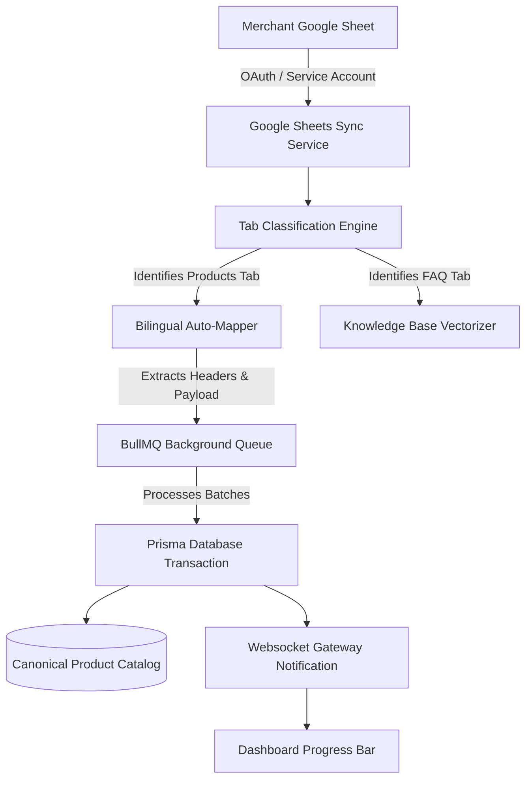

# [Google Sheets Automated Synchronization](https://autozeniq.com/features/google-sheets-sync)

## Overview

The **AutoZeniq Google Sheets Synchronization Service** enables merchants to use standard Google Spreadsheets as a live, bi-directional database for products, inventory stock, FAQs, and business policies. Rather than requiring complex ERP setups, online sellers can manage their catalog in Google Sheets while AutoZeniq automatically maps, normalizes, and syncs the data into the platform's canonical database.

Featuring an AI-powered sheet normalizer and bilingual column header recognition (supporting English and Bengali terms like `পণ্যের নাম`, `মূল্য`, `স্টক`), the service continuously reconciles spreadsheet rows with active storefront inventory and conversational AI contexts.

---

## Technical Architecture

### Architecture Specifications

1. **Credential Vault Integration (`credential-vault.service.ts`)**:
   * Google OAuth access tokens, refresh tokens, and Service Account private key JSONs are encrypted at rest using AES-256-GCM encryption before storage in PostgreSQL.
2. **Tab Classification Engine**:
   * Scans sheet metadata (`DiscoveredTab`) and calculates heuristic confidence scores to categorize tabs into:
     * `products`: Catalogs containing SKUs, pricing, and stock quantities.
     * `faq`: Question and Answer datasets.
     * `policies`: Shipping, refund, and warranty guidelines.
     * `knowledge`: General company and operational details.
3. **Bilingual Column Header Auto-Mapping (`COLUMN_ALIASES`)**:
   * Automatically resolves column names without requiring manual configuration:
     * **SKU**: `sku`, `product_id`, `code`, `id#`, `variant sku`.
     * **Product Name**: `name`, `product name`, `title`, `পণ্যের নাম`, `product_title`.
     * **Base Price**: `price`, `unit price`, `regular price`, `mrp`, `মূল্য`, `দাম`.
     * **Sale Price**: `saleprice`, `offer price`, `discount price`, `অফার মূল্য`.
     * **Stock Quantity**: `stock`, `qty`, `quantity`, `available stock`, `স্টক`.
     * **Description**: `description`, `details`, `desc`, `বিবরণ`.
     * **Category**: `category`, `category_name`, `ক্যাটাগরি`.
     * **Variants**: `variant`, `size`, `weight`, `সাইজ`, `ওজন`.
4. **Asynchronous BullMQ Pipeline & WebSocket Gateway**:
   * Ingestion jobs execute asynchronously within Redis BullMQ workers to prevent HTTP timeout issues on spreadsheets containing tens of thousands of rows. Real-time progress updates are emitted to frontend clients via WebSockets (`WebsocketGateway`).

---

## Core Features

### 1. Zero-Configuration Smart Sync
* Connect a Google Sheet URL or ID; the system inspects all sheets, discovers tabs, and automatically maps columns with over 95% accuracy.
* Visual preview screen allowing merchants to review and override column pairings before applying mutations.

### 2. Automated Scheduled Polling & Webhook Triggers
* **Periodic Cron Sync**: Background cron workers poll connected sheets at configurable intervals (e.g., hourly, every 6 hours, daily) to detect price and stock changes.
* **On-Demand Manual Sync**: Single-click "Sync Now" button in the dashboard for immediate updates.

### 3. Canonical Inventory & Product Normalization
* Converts disparate spreadsheet structures into the platform's standardized `Product` and `ProductVariant` schema models.
* Generates search indexes and embedding chunks so the conversational AI Agent can answer inquiries such as: "Is the black M-size polo shirt available?"

### 4. Conflict Resolution & Error Isolation
* Malformed rows (e.g., text in a numeric price column) are logged as warnings and skipped without interrupting the synchronization of valid catalog rows.

---

## Benefits

* **No Technical Barrier**: Small business owners already familiar with spreadsheets can manage inventory without learning complex software interfaces.
* **Real-Time Stock Accuracy**: Avoids overselling on Facebook Messenger and web storefronts by maintaining synchronized stock balances.
* **Instant Conversational Grounding**: Product changes in Google Sheets are instantly accessible to AI customer support agents.

---

## FAQ

### Q: What permissions are required on the Google Sheet?
**A:** If using the Google Service Account flow, the merchant simply shares the spreadsheet with the system's generated service account email as a "Viewer". If using Google OAuth login, the user approves read-only Drive and Sheets scopes.

### Q: Can the sync write orders back into the Google Sheet?
**A:** Yes, the two-way sync configuration allows new confirmed orders to be appended to a designated "Orders" tab in the merchant's spreadsheet.

---

## Related Documents

* [Data Sources Dashboard](./conversation-management.md)
* [Storefront Builder](../products/store-builder.md)
* [Order Management System](../products/order-management.md)
* [Google Sheets Integration Guide](../integrations/google-sheets.md)
