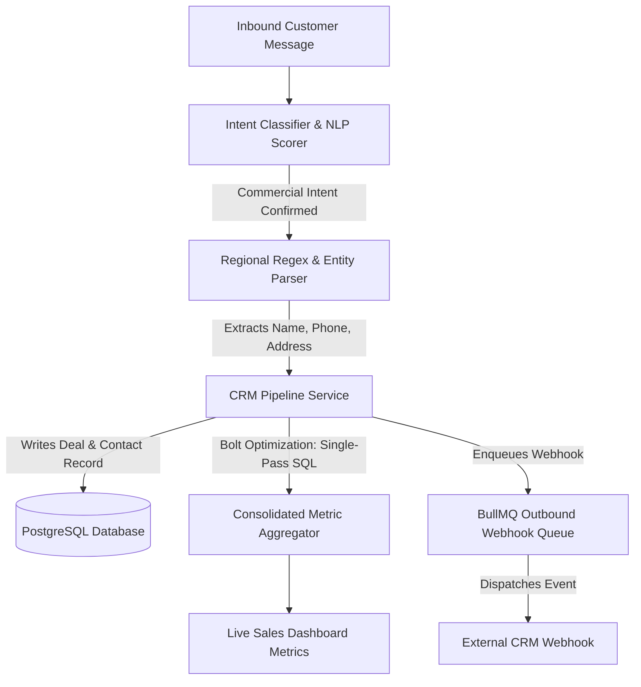

# [Lead Detection & Intent Scoring Feature](https://autozeniq.com/solutions/lead-management)

## Overview

The AutoZeniq **Lead Detection & Intent Scoring** engine continuously inspects incoming customer conversation streams to detect commercial buying intent, extract recipient contact information (names, mobile phone numbers, delivery addresses, product interests), and populate the [CRM & Sales Pipeline](../products/crm-leads.md).

Upgraded with single-pass database metric calculations (the Bolt performance optimization) and seamless synchronization with visual Kanban deal boards, the engine converts casual inquiries into structured, high-probability sales opportunities with zero manual data entry.

---

## Technical Architecture

### Architecture Specifications

1. **Intent Scoring & NLP Classification**:
   * Scans incoming messages against commercial keyword clusters and semantic intent models (inquiries regarding wholesale discounts, bulk orders, delivery turnaround times, or payment methods).
   * Generates a normalized Intent Score (0 to 100), tagging high-intent leads automatically.
2. **Regional Entity Extraction & Phone Sanitization**:
   * Utilizes regex models optimized for Bangladesh telecommunication formats (`+8801XXXXXXXXX`, `01XXXXXXXXX`, and varied spacing/dash configurations).
   * Parses localized address patterns, dividing strings into Street Address, Police Station (Thana), and District.
3. **Consolidated Lead Metrics (Bolt Performance Optimization)**:
   * Replaced sequential multi-query aggregations with an optimized, single-pass SQL query (`pipeline.service.ts`).
   * Computes total lead counts, conversion velocity, deal value distributions, and stage win/loss ratios in a single database roundtrip, significantly accelerating CRM dashboard load times.
4. **CRM Pipeline Synchronization**:
   * Automatically creates or updates the customer's contact record in the database, assigning them to the `NEW` or `QUALIFIED` stage on the visual Kanban board.

---

## Core Features

*   **Zero-Manual Contact Capture**: Automatically logs customer names, phone numbers, and delivery locations from unstructured natural language chats.
*   **Intent-Based Lead Scoring**: Quantifies customer purchasing intent to allow sales teams to prioritize high-value prospects.
*   **Kanban Sales Pipeline Integration**: Qualified leads are immediately visible on the [CRM & Lead Pipeline](../products/crm-leads.md) board.
*   **Automated Work Queues & Task Reminders**: Schedules automated follow-up tasks when a high-intent prospect does not complete a checkout within 24 hours.
*   **Multi-Channel Source Attribution**: Tracks whether a lead originated from a Facebook Page ad, Instagram DM story reply, WhatsApp conversation, or storefront widget.

---

## Benefits

*   **Eliminates Data Entry Bottlenecks**: Sales reps spend their time closing deals rather than copying customer phone numbers into spreadsheets.
*   **Instant Sales Engagement**: Proactive alerts notify account managers the moment a wholesale or high-ticket inquiry is received.
*   **Consolidated High Performance**: Optimized single-pass database queries maintain snappy dashboard response times even across workspaces tracking tens of thousands of active leads.

---

## FAQ

### Q: Does the lead detector support Bengali phone numbers and addresses?
**A:** Yes. The extraction regex models are specifically optimized for standard phone structures used in Bangladesh, and the AI models can parse addresses and names written in English, Bengali, or phonetic Banglish.

### Q: What happens if a lead contacts us multiple times?
**A:** The system deduplicates records using the verified phone number as the primary identifier, merging new chat transcripts into the customer's existing profile without creating duplicate records.

---

## Related Documents

* [CRM & Lead Pipeline](../products/crm-leads.md)
* [Conversation Management](./conversation-management.md)
* [Adaptive RAG Feature](./adaptive-rag.md)
* [Order Management System](../products/order-management.md)
