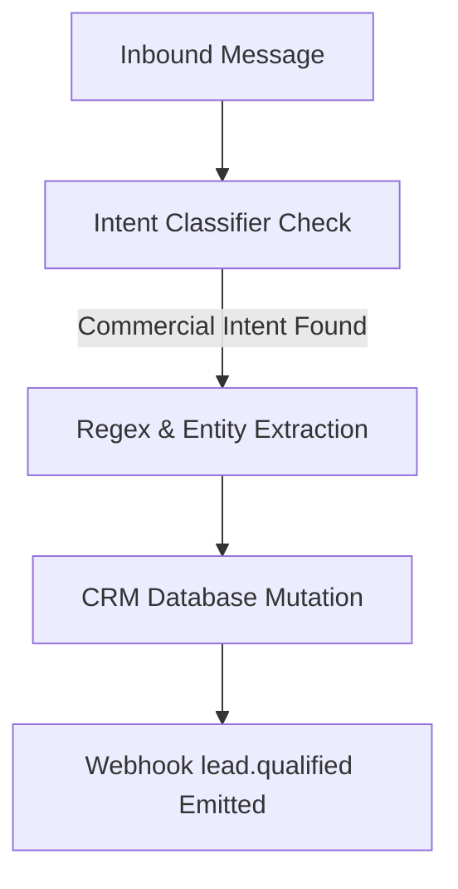

# Lead Detection Feature

## Overview

The AutoZeniq **Lead Detection** module analyzes customer messages to identify commercial intent, extract contact details (such as names, phone numbers, email addresses, and locations), and write them directly into the CRM database.

---

## Technical Architecture

The lead detection engine processes messages through the following stages:

### Simple Explanation
When a customer sends a message sharing their contact details (e.g. "My number is 017xxxxxxxx") or asking to make a purchase, AutoZeniq's AI reads the message, copies the name and number, and logs them in your contact book under a "Lead" tag. Your sales team is notified immediately.

### Technical Explanation
1.  **Intent Classifier Check**: Every incoming message saved to PostgreSQL is processed by intent classifiers. The platform scans for keyword patterns and NLP semantic clusters that indicate buying interest (e.g., asking for wholesale pricing, payment options, or booking details).
2.  **Entity Extraction & Parsing**: Once intent is confirmed, the message is scanned by parser routines. The system uses specific regex models optimized for regional patterns (e.g. Bangladesh mobile prefixes like `+880` and `01`) alongside LLM entity extractors to isolate names, emails, and address strings.
3.  **CRM Database Mutation**: Extracted contact attributes are mapped and written to the tenant's `contacts` table. If the contact record already exists, it is updated and tagged as a `Lead`.
4.  **Event Webhook Dispatch**: A `lead.qualified` event is queued in Redis (`BullMQ`) and sent to the tenant's configured outgoing webhook endpoint to update external CRMs (like HubSpot).

---

## Core Features

*   **Intent Scoring**: Calculates a customer's purchasing probability based on chat content and tags high-intent threads.
*   **Auto Contact Ingestion**: Saves names, phone numbers, and emails extracted from natural chat conversations without forms.
*   **Auto-Segment Tagging**: Applies custom segments (e.g., "Wholesale Lead", "Facebook Comment Lead") based on the source channel and triggers.
*   **External Sync Webhooks**: Sends qualified lead details to external software systems in real time.

---

## Benefits

*   **Zero Manual Lead Entry**: Eliminates manual copying of customer numbers and names from chat logs to sales sheets.
*   **Immediate Sales Follow-up**: Notifies sales teams of high-value prospects immediately.
*   **Clean Contacts List**: Prevents duplicate contact cards by merging records using phone numbers or social user IDs as unique keys.

---

## FAQ

### Q: Does the lead detector support Bengali phone numbers and addresses?
**A:** Yes. The extraction regex models are specifically optimized for standard phone structures used in Bangladesh, and the AI models can parse addresses and names written in English, Bengali, or phonetic Banglish.

### Q: Can I configure rules to trigger only on specific posts?
**A:** Yes. The Rule Engine allows you to restrict lead detection parameters to trigger only on specific channels, pages, or even specific post IDs.

---

## Related Documents

*   [Automation Features](./automation.md)
*   [Conversation Management](./conversation-management.md)
*   [Lead Management Solution](../solutions/lead-management)
