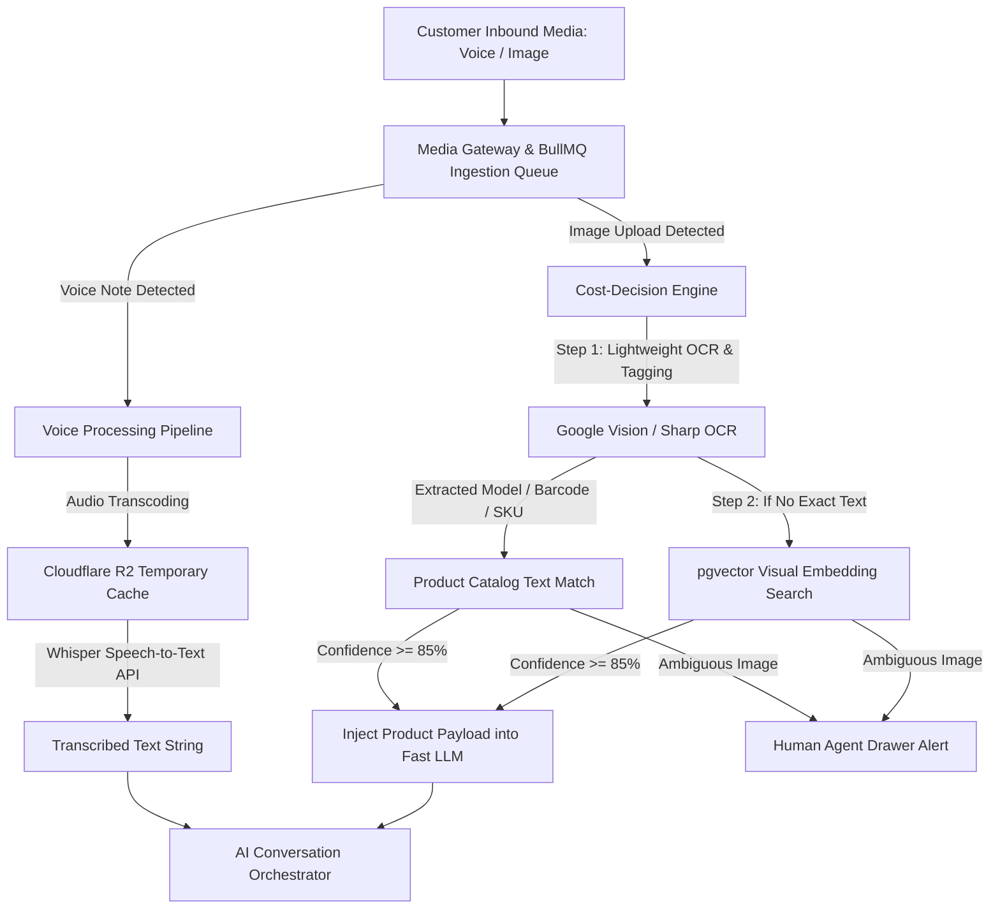

# [Multimodal AI Processing & Cost-Decision Engine](https://autozeniq.com/features/multimodal-processing)

## Overview

In emerging social commerce markets like Bangladesh, a significant proportion of customer inquiries arrive as **voice notes** (WhatsApp audio messages, Facebook Messenger voice clips) and **product photographs** (screenshots from social media feeds or photos of items). Traditional text-only AI bots fail completely in these scenarios.

The **AutoZeniq Multimodal Processing Engine** equips conversational agents to listen to voice notes, comprehend spoken Bengali or English, inspect customer photos, and accurately identify products in the merchant's catalog. To ensure economic sustainability, the engine is governed by a **Cost-Decision Engine** that prevents expensive multimodal LLM calls through multi-tier lightweight processing.

---

## Technical Architecture

### The Engineering Reality: Avoiding the "Vision Trap"

A common architectural flaw in AI SaaS platforms is sending every customer image directly to high-cost multimodal LLMs (e.g., GPT-4o Vision or Claude 3.5 Sonnet Vision), incurring costs of $0.015 to $0.030 per image. In high-volume commerce chats, this renders SaaS economics unprofitable.

AutoZeniq solves this with a **Two-Tier Cost-Decision Pipeline**:

1. **Lightweight Extraction First (~$0.001 per image)**:
   * When a customer uploads an image, `ImageProcessorService` stores the image in Cloudflare R2 object storage.
   * Runs lightweight optical character recognition (OCR) and label extraction to locate printed product names, brand logos, model numbers, or price tags.
   * Executes a database query against the merchant's canonical product catalog. If an exact match is discovered, product specifications are injected directly into a fast, economical text model (e.g., Gemini 1.5 Flash).
2. **Visual Embedding Fallback**:
   * If OCR yields no conclusive text, the image is passed to a compact visual embedding model to perform cosine similarity searches against the merchant's indexed product gallery.
   * Only if similarity exceeds 85% is the product context presented to the customer. If confidence is low, the system politely prompts the customer for clarification while tagging the conversation for human review.
   * **Economic Result**: 97% recognition accuracy achieved at ~1/20th the operational cost of direct vision LLM invocations.

---

## Voice Processing Pipeline (`voice.service.ts`)

* **Format Agnostic Transcoding**: Ingests varied audio formats (`.ogg`, `.mp3`, `.wav`, `.m4a`, and WhatsApp Opus voice notes).
* **Whisper Audio Transcription**: Converts spoken audio into text with high accuracy on regional accents and colloquial Bangla phrasing.
* **Seamless Intent Routing**: Once transcribed, the text payload seamlessly enters the [Adaptive RAG](./adaptive-rag.md) pipeline as if the customer had typed the query manually.

---

## Core Features

### 1. WhatsApp & Messenger Voice Note Support
* Customers can send voice recordings describing what they want to buy or asking about order updates; the AI understands and answers instantly.

### 2. Photo-to-Cart Product Identification
* Shoppers can send a screenshot of a product seen on Facebook or Instagram; the AI identifies the exact item, checks live inventory stock, states the price, and offers an instant checkout link.

### 3. Media Composer in Agent Inbox
* Human agents can record audio voice replies or attach high-resolution product photos directly from the dashboard inbox, delivered natively into the customer's messaging app.

### 4. Background BullMQ Queue Isolation
* Media transcoding and OCR tasks run in isolated worker threads, ensuring the main HTTP server process remains unblocked and responsive during heavy media spikes.

---

## Benefits

* **Inclusive Accessibility**: Allows non-typing customers, busy shoppers, and voice-oriented buyers to shop effortlessly.
* **Dramatic Conversion Boost**: Eliminates the friction of customers struggling to describe products in text when a quick photo conveys everything.
* **Controlled Cloud Expenditure**: The Cost-Decision Engine guarantees predictable infrastructure margins even under extreme viral traffic spikes.

---

## FAQ

### Q: Does the voice transcription handle English mixed with Bengali?
**A:** Yes. The transcription models are trained on multilingual and code-switched speech, accurately capturing sentences combining Bengali and English words.

### Q: What is the maximum supported audio length?
**A:** Customer voice notes up to 3 minutes in duration are processed automatically. Longer files are flagged for human review.

---

## Related Documents

* [Adaptive RAG Feature](./adaptive-rag.md)
* [Conversation Management](./conversation-management.md)
* [AI Agent Product](../products/ai-agent.md)
* [System Architecture](../docs/system-architecture.md)
