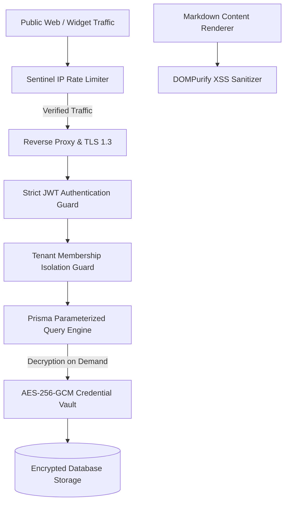

# [AutoZeniq Sentinel Security Framework & Vulnerability Remediation](https://autozeniq.com/security/sentinel)

## Overview

The **AutoZeniq Sentinel Security Framework** represents a comprehensive platform hardening initiative designed to safeguard multi-tenant data, public web widgets, and AI infrastructure from cyber threats, denial-of-service attempts, data leakage, and malicious code injections.

Through automated code audits, security penetration testing, and architectural refactoring, the platform enforces defense-in-depth across the network, application, database, and cryptographic layers.

---

## Key Security Hardening Milestones

### 1. Sentinel IP-Based Rate Limiting on Public Endpoints
* **Vulnerability Mitigated**: Denial of Service (DoS), brute force credential guessing, and automated scraping on public web chat widget endpoints (`/widget/*`) and public knowledge retrieval APIs (`/knowledge/public/*`).
* **Implementation**: Enforces dual-layer sliding-window rate limiters utilizing Redis memory counters:
  * Restricts incoming requests per IP address to safe operational thresholds (e.g., 60 requests per minute per IP for widget interaction).
  * Automatically returns `429 Too Many Requests` with `Retry-After` headers when limits are exceeded.

### 2. SQL Injection Remediation in Vector & Knowledge APIs
* **Vulnerability Mitigated**: Critical SQL injection risk stemming from dynamic raw query strings inside vector search and embedding indexing routines.
* **Remediation**:
  * Completely removed all instances of `$executeRawUnsafe` and `$queryRawUnsafe` across `knowledge.service.ts` and `embedding.processor.ts`.
  * Migrated all custom PostgreSQL vector calculations (`<=>` cosine distance operators) to compile-time type-safe, parameterized Prisma `$executeRaw` and `$queryRaw` statements with strict variable binding.

### 3. Markdown XSS Sanitization with DOMPurify
* **Vulnerability Mitigated**: Stored Cross-Site Scripting (XSS) attacks through malicious HTML/JavaScript payloads embedded in blog articles, CMS posts, or customer support documentation.
* **Remediation**:
  * Implemented server-side and client-side sanitization using `DOMPurify` before rendering markdown markup.
  * Strips dangerous tags (`<script>`, `<iframe>`, `onload` attributes) while preserving authorized formatting tags, tables, and code snippets.

### 4. Hardcoded JWT Secret Elimination in Production
* **Vulnerability Mitigated**: Exposure of fallback JWT signing secrets allowing malicious actors to forge arbitrary tenant access tokens if environment variables were misconfigured.
* **Remediation**:
  * Removed development fallback keys. The NestJS `ConfigService` enforces mandatory verification upon application startup; if `JWT_SECRET` is missing, insufficiently long (<32 characters), or contains development placeholders in production mode, the application halts immediately with an initialization error.

### 5. Cryptographic Credential Vault & Regression Test Suite
* **Vulnerability Mitigated**: Plaintext exposure of third-party integration secrets (Meta App Secrets, Pathao API Client Secrets, Google Service Account JSON keys).
* **Remediation**:
  * All credentials are encrypted at rest using authenticated symmetric `AES-256-GCM` encryption with cryptographically random initialization vectors (IV) and authentication tags.
  * Accompanied by unit and regression test suites (`encryption.util.spec.ts`) validating key rotation, roundtrip integrity, and tamper-detection mechanisms.

### 6. Strict Tenant Membership Guards
* **Vulnerability Mitigated**: Horizontal privilege escalation where an authenticated user of Tenant A attempts to access records belonging to Tenant B.
* **Remediation**:
  * Enforced `TenantMembershipGuard` middleware across all dashboard API endpoints. Validates that the requesting user's active session is explicitly mapped to the requested `tenantId` in the `tenant_memberships` table with appropriate role permissions (`OWNER`, `ADMIN`, `AGENT`).

---

## Core Security Specifications

| Layer | Protocol / Technology | Security Guarantee |
| :--- | :--- | :--- |
| **Transport** | TLS 1.3 / HTTPS | Encrypted data in transit across all endpoints |
| **API Authentication** | Stateless JWT (HS256/RS256) | Tamper-proof session validation |
| **Tenant Isolation** | Logical schema partitioning by `tenant_id` | Strict prevention of cross-tenant data leakage |
| **Secrets at Rest** | `AES-256-GCM` with random IVs | Secure credential vault for API keys & tokens |
| **Outgoing Hooks** | `HMAC-SHA256` signatures | Verification of webhook origin and payload integrity |
| **Public Endpoints** | Redis sliding window rate limits | DDoS and brute force protection |

---

## FAQ

### Q: How often are security vulnerability audits conducted?
**A:** Automated static code analysis (SAST) and dependency vulnerability scanners run in the continuous integration (CI) pipeline on every pull request. Architectural reviews are conducted on all external integration endpoints.

### Q: What should a security researcher do upon discovering a potential vulnerability?
**A:** Vulnerabilities can be reported directly to `security@autozeniq.com`. Reports are reviewed by our engineering team within 24 hours under our responsible disclosure program.

---

## Related Documents

* [Security and Compliance](../security.md)
* [Adaptive RAG Feature](./adaptive-rag.md)
* [System Architecture](../docs/system-architecture.md)
* [Developer API Integration](../integrations/api.md)
