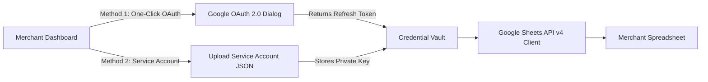

# [Google Sheets API Integration Guide](https://autozeniq.com/integrations/google-sheets)

## Overview

The **AutoZeniq Google Sheets Integration** allows merchants to connect Google Spreadsheets to their AutoZeniq workspace to serve as a real-time product database, pricing controller, and knowledge source.

Whether using Google OAuth login or a dedicated Google Cloud Service Account, the integration maintains a persistent, encrypted channel to poll and stream changes from spreadsheets into the platform.

---

## Technical Connection Methods

### Connection Option A: One-Click Google OAuth (Recommended for SMEs)
1. Navigate to **Data Sources > Connect Google Sheets** in the dashboard.
2. Click **Connect with Google**.
3. Select your Google account and grant read permissions to Google Drive / Sheets.
4. AutoZeniq exchanges the authorization code for a long-lived refresh token, securely storing it in the [Credential Vault](../features/sentinel-security.md).
5. Paste your Spreadsheet URL or select from your recent Google Sheets list.

### Connection Option B: Google Cloud Service Account (Recommended for Enterprise)
1. Create a service account in your Google Cloud Console project with the `Google Sheets API` enabled.
2. Generate a JSON Key for the service account.
3. In the AutoZeniq dashboard, upload the Service Account JSON key.
4. Open your target Google Sheet and share it with the generated Service Account email (e.g., `autozeniq-sync@project-id.iam.gserviceaccount.com`) as a **Viewer** or **Editor**.

---

## Spreadsheet Structure Recommendations

To ensure optimal auto-mapping performance, format your spreadsheet with clean header columns in the first row. The system understands both English and Bengali headers automatically:

| Recommended Header (English) | Recognized Bengali Aliases | Description |
| :--- | :--- | :--- |
| `sku` | `product id`, `code` | Unique item identifier |
| `name` | `পণ্যের নাম`, `title`, `product` | Product title |
| `basePrice` | `মূল্য`, `দাম`, `regular price` | Standard selling price in BDT |
| `salePrice` | `অফার মূল্য`, `discount price` | Discounted promotional price |
| `stockQuantity` | `স্টক`, `qty`, `available stock`| Current inventory count |
| `category` | `ক্যাটাগরি`, `group` | Product collection/category |
| `description` | `বিবরণ`, `details` | Product description / features |
| `variant` | `সাইজ`, `ওজন`, `size`, `color` | Variant specifics |

---

## Synchronization Modes

* **Automated Periodic Cron**: The background worker polls the spreadsheet every hour or daily, identifying modified row hashes and applying updates without merchant intervention.
* **Manual Immediate Trigger**: Click **Sync Now** to pull the latest changes instantly before launching a sales campaign.
* **Two-Way Order Append**: Optionally configure an "Orders" sheet where new confirmed customer orders are appended with full customer details and item summaries.

---

## FAQ

### Q: Does AutoZeniq modify existing formatting or formulas in my Google Sheet?
**A:** No. AutoZeniq only reads raw values using the Google Sheets API `UNFORMATTED_VALUE` flag, leaving your formulas, custom formatting, and color highlights untouched.

### Q: What is the maximum number of rows supported?
**A:** The asynchronous BullMQ processing pipeline handles spreadsheets with up to 50,000 rows smoothly by batching ingestion into 500-row chunks.

---

## Related Documents

* [Google Sheets Synchronization Feature](../features/google-sheets-sync.md)
* [Storefront Builder](../products/store-builder.md)
* [Order Management System](../products/order-management.md)
* [Sentinel Security & Credential Vault](../features/sentinel-security.md)
