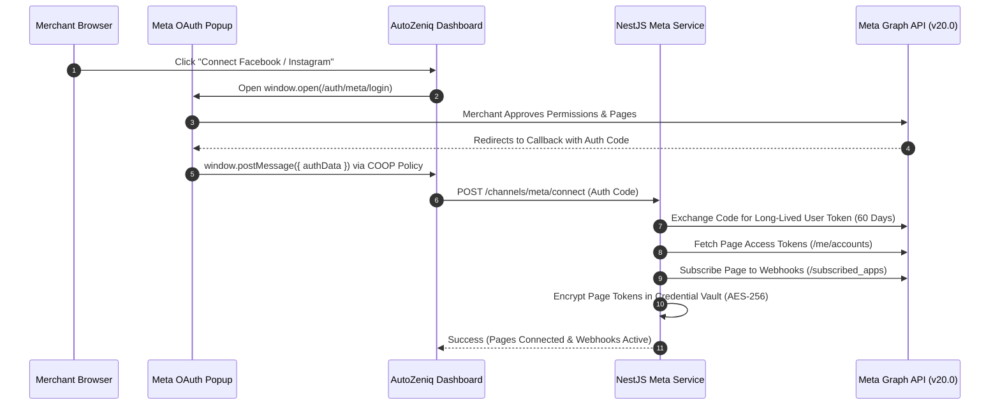

# [Meta Platform Native OAuth Integration](https://autozeniq.com/integrations/meta-oauth)

## Overview

The **AutoZeniq Meta Platform Integration** provides a native, one-click authorization flow enabling merchants to connect their Facebook Pages, Facebook Messenger, and Instagram Direct Messaging channels to the AutoZeniq Unified Inbox.

Replacing error-prone manual page access token copying, the integration uses Meta's official OAuth 2.0 Business Login dialog with automated popup window messaging, long-lived system token exchange, daily cryptographic token health validation, and multi-channel webhook routing.

---

## Technical Architecture

### Architecture Specifications

1. **Cross-Origin-Opener-Policy (COOP) Configuration**:
   * Configured Helmet middleware with `same-origin-allow-popups` to enable secure `window.postMessage` cross-window event communication between the Meta OAuth popup callback window and the parent dashboard window.
2. **Long-Lived Token Exchange**:
   * Short-lived authorization codes received from the popup dialog are immediately exchanged for 60-day long-lived User Access Tokens (`oauth/access_token?grant_type=fb_exchange_token`).
   * Permanent Page Access Tokens are retrieved via Graph API `/me/accounts` and encrypted at rest in the `CredentialVaultService`.
3. **Automated Webhook Subscriptions**:
   * Automatically executes `POST /{page-id}/subscribed_apps` with `subscribed_fields: ['messages', 'messaging_postbacks', 'feed', 'message_deliveries', 'message_reads']`.
4. **Daily Token Validation Cron**:
   * A scheduled NestJS cron worker executes daily, querying Meta's `/debug_token` endpoint for every connected page. If token expiration, permission revocation, or merchant password changes are detected, the system updates channel health status and alerts the tenant.

---

## Supported Meta Channels

* **Facebook Messenger**: Real-time two-way messaging, quick replies, carousel templates, and typing indicators.
* **Facebook Page Post Comments**: Automated public replies to customer comments on posts and live broadcasts, with automated private inbox follow-ups.
* **Instagram Direct Message (DM)**: Story replies, direct messages, and media attachment exchange.

---

## Configuration & Permissions

During the one-click Meta login popup, merchants approve the following Graph API scopes:

* `pages_show_list`: Discovers merchant pages.
* `pages_messaging`: Ingests and responds to Messenger conversations.
* `instagram_basic` & `instagram_manage_messages`: Powers Instagram DM automation.
* `pages_read_engagement` & `pages_manage_posts`: Handles comment automation.

---

## FAQ

### Q: What happens when a merchant changes their Facebook account password?
**A:** Meta immediately invalidates all active session tokens. AutoZeniq's Daily Token Validation Cron detects the invalid token, flags the channel with a warning badge in the dashboard, and notifies the tenant administrator to execute a one-click re-authorization.

### Q: Can multiple Facebook Pages be connected to a single workspace?
**A:** Yes. Depending on the tenant's subscription tier, multiple Facebook Pages and Instagram accounts can be managed concurrently from the same Unified Inbox.

---

## Related Documents

* [Unified Inbox Feature](../features/unified-inbox.md)
* [Facebook Messenger Integration](./facebook-messenger.md)
* [Sentinel Security & Credential Vault](../features/sentinel-security.md)
* [System Architecture](../docs/system-architecture.md)
