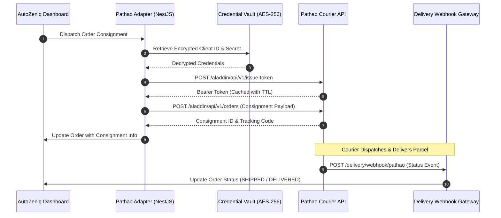

# [Pathao Courier API Integration](https://autozeniq.com/integrations/pathao)

## Overview

**Pathao Courier** is one of the largest logistics and parcel delivery networks in Bangladesh. The AutoZeniq Pathao integration connects merchants' stores and OMS directly to Pathao's B2B Merchant API, automating city and zone resolution, store/hub selection, parcel consignment creation, and real-time delivery tracking updates.

Once integrated, orders in the AutoZeniq dashboard can be dispatched to Pathao with a single click or automatically via predefined business rules.

---

## Technical Architecture

### Architecture Specifications (`pathao.adapter.ts`)

1. **OAuth 2.0 Token Lifecycle**:
   * Communicates with Pathao Aladdin API endpoint (`/aladdin/api/v1/issue-token`).
   * Caches issued bearer tokens in Redis with time-to-live (TTL) expiration minus a 5-minute safety buffer, preventing unnecessary re-authentication roundtrips.
2. **Geographic Zone & Store Resolution**:
   * Queries Pathao's city, zone, and area endpoints (`/aladdin/api/v1/cities`, `/aladdin/api/v1/cities/{id}/zone-list`, `/aladdin/api/v1/zones/{id}/area-list`).
   * Maps customer delivery addresses to Pathao's internal geographic IDs.
3. **Consignment Creation Payload**:
   * Maps order fields to Pathao parameters:
     * `store_id`: Merchant's pickup warehouse ID.
     * `recipient_name`: Customer full name.
     * `recipient_phone`: Sanitized 11-digit mobile number (`01XXXXXXXXX`).
     * `recipient_address`: Detailed street and house address.
     * `recipient_city`, `recipient_zone`, `recipient_area`: Pathao zone IDs.
     * `delivery_type`: Standard (48 hrs) or Express (24 hrs).
     * `item_type`: Parcel / Document.
     * `item_quantity`, `item_weight`: Calculated parcel weight in kilograms.
     * `amount_to_collect`: Cash on Delivery (COD) amount.
     * `item_description`: Ordered item names and quantities.
4. **Webhook Handler (`/delivery/webhook/pathao`)**:
   * Ingests delivery milestone events emitted by Pathao's servers.
   * Maps Pathao status codes (`Pickup_Requested`, `Assigned_For_Pickup`, `Picked`, `In_Transit`, `Delivered`, `Returned`) to AutoZeniq standard state machine statuses.

---

## Configuration & Credentials

Merchants configure their Pathao integration within **Settings > Integrations > Delivery > Pathao**:

* **Client ID**: Pathao Developer API Client ID.
* **Client Secret**: Pathao Developer Secret Key (encrypted at rest).
* **Username / Email**: Registered merchant portal login email.
* **Password**: Registered merchant portal password.
* **Default Store ID**: Primary pickup warehouse configured in the Pathao merchant panel.

---

## Core Features

* **One-Click Consignment Generation**: Book delivery without navigating to the Pathao portal.
* **Automated Parcel Weight Calculation**: Aggregates weight across ordered product variants to ensure accurate shipping rates.
* **Automated Customer Tracking Links**: Emits real-time tracking links to customers via WhatsApp or SMS upon consignment generation.
* **COD Settlement Auditing**: Cross-checks Pathao payment disbursement invoices against order balances.

---

## FAQ

### Q: What happens if an invalid phone number or address is submitted?
**A:** The Pathao adapter validates phone number prefixes and character lengths before making API calls. If validation fails, an alert is displayed in the dashboard prompting the agent to correct the address.

### Q: Does Pathao support reverse pickups for customer returns?
**A:** Yes. The [Returns & Takeover Automation](../features/returns-takeover-automation.md) module can initiate return consignments to pick up returned items from the customer's doorstep.

---

## Related Documents

* [Delivery & Logistics Automation](../products/delivery-logistics.md)
* [Steadfast Courier Integration](./steadfast-courier.md)
* [Order Management System](../products/order-management.md)
