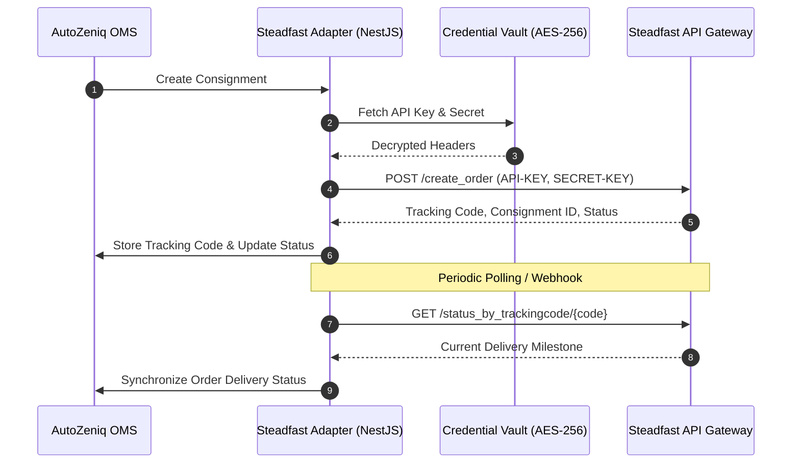

# [Steadfast Courier API Integration](https://autozeniq.com/integrations/steadfast)

## Overview

**Steadfast Courier** is one of Bangladesh's fastest-growing logistics service providers, recognized for extensive delivery coverage across suburban and rural upazilas and fast COD remittances. The AutoZeniq Steadfast integration connects merchants directly to Steadfast's REST API, enabling rapid consignment booking, tracking status lookups, and balance auditing.

---

## Technical Architecture

### Architecture Specifications (`steadfast.adapter.ts`)

1. **Header-Based Authentication**:
   * Steadfast requests require persistent HTTP headers:
     * `Api-Key`: Merchant API Key.
     * `Secret-Key`: Merchant Secret Key.
     * `Content-Type`: `application/json`.
   * Credentials are encrypted at rest using AES-256-GCM in the `CredentialVaultService`.
2. **Consignment Creation Payload**:
   * Endpoint: `https://portal.steadfast.com.bd/api/v1/create_order`.
   * Maps internal order fields:
     * `invoice`: Unique AutoZeniq order reference (`ORD-YYYYMMDD-XXXXXXXX`).
     * `recipient_name`: Customer full name.
     * `recipient_phone`: Sanitized 11-digit mobile number.
     * `recipient_address`: Full delivery address.
     * `cod_amount`: Total Cash on Delivery collection amount.
     * `note`: Special delivery instructions.
3. **Status Synchronization**:
   * Endpoint: `/status_by_trackingcode/{code}` or `/status_by_invoice/{invoice}`.
   * Maps Steadfast status strings (`in_review`, `pending`, `delivered_approval_pending`, `delivered`, `partial_delivered`, `cancelled`, `hold`) directly into AutoZeniq's standardized status state machine.

---

## Configuration & Credentials

Merchants configure Steadfast integration inside **Settings > Integrations > Delivery > Steadfast**:

* **API Key**: Found in Steadfast Merchant Portal under API settings.
* **Secret Key**: Secret authentication key generated from the portal.

---

## Core Features

* **Instant Consignment Dispatch**: Book deliveries in under two seconds directly from the order dashboard.
* **Automated Invoice Tracking**: Look up deliveries using either Steadfast's tracking code or the internal AutoZeniq order number.
* **High Rural Reach**: Seamlessly fulfills orders destined for remote upazilas and thanas outside Dhaka metro.
* **Direct COD Reconciliation**: Automatically marks orders as `PAID` upon receiving confirmed delivery status from Steadfast.

---

## FAQ

### Q: Does Steadfast require separate city/zone IDs like Pathao?
**A:** No. Steadfast uses standard address text parsing, simplifying consignment payloads by not requiring pre-flight zone resolution calls.

### Q: Can a merchant toggle between Pathao and Steadfast?
**A:** Yes. Merchants can select their courier of choice on a per-order basis, or configure the auto-booking engine to route Dhaka metro orders to Pathao and outside-Dhaka orders to Steadfast.

---

## Related Documents

* [Delivery & Logistics Automation](../products/delivery-logistics.md)
* [Pathao Courier Integration](./pathao-courier.md)
* [Order Management System](../products/order-management.md)
