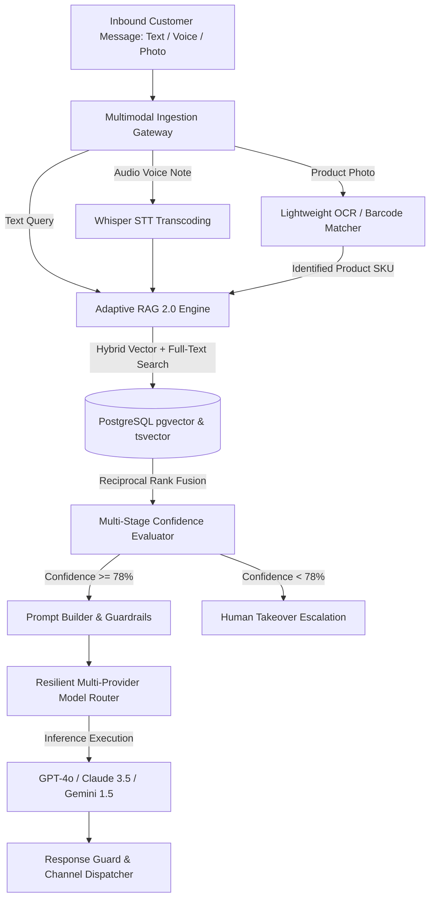

# [AutoZeniq AI Agent](https://autozeniq.com/features/ai-agent)

## Overview

The **AutoZeniq AI Agent** is an autonomous, context-aware conversational engine designed for retail sales, customer support, and commercial workflow execution. Operating across WhatsApp, Facebook Messenger, Instagram DM, Telegram, and website chat widgets, the agent goes beyond static question-answering by listening to customer voice notes, recognizing products from uploaded photos, validating live stock, and initiating checkout orders.

---

## Technical Architecture

The AI Agent combines multi-channel ingestion, multimodal pre-processing, hybrid retrieval, and dynamic model routing:

### Architectural Subsystems

1. **Multimodal Audio & Vision Pipelines**:
   * **Voice Notes**: Uses `VoiceService` and Whisper STT to transcribe customer voice notes across English, standard Bengali, and colloquial Banglish into normalized text streams.
   * **Cost-Decision Vision**: Employs lightweight OCR (via Sharp / Google Vision) to locate text, model numbers, and barcodes from customer screenshots (~$0.001/call), falling back to `pgvector` visual embeddings only if text matching is inconclusive.
2. **Adaptive RAG 2.0 with Hybrid Search**:
   * Merges dense vector embeddings (`pgvector` HNSW cosine similarity) with sparse lexical search (PostgreSQL `tsvector`) using Reciprocal Rank Fusion (RRF).
   * Decomposes ambiguous customer phrasing into structured sub-queries via multi-query reflection.
3. **Multi-Stage Confidence Safeguards**:
   * Evaluates semantic relevance scores. If composite confidence drops below tenant thresholds (e.g. 0.78), the agent suppresses autonomous replies and quietly routes the thread to human operators.
4. **Resilient Multi-Provider Model Router**:
   * Routes prompt payloads across OpenAI GPT-4o, Anthropic Claude 3.5 Sonnet, and Google Gemini 1.5 Flash with automated circuit-breaker failover and per-message token cost tracking.

---

## Core Features

*   **Closed-Loop Commerce**: Answers product questions, verifies live inventory stock, calculates zone-based shipping, and generates verified orders directly in chat.
*   **Multimodal Audio & Photo Understanding**: Handles customer voice notes and product photos natively without requiring manual text typing.
*   **Trilingual Comprehension**: Native fluency in standard English, formal Bengali, and phonetic Banglish ("eitar price koto?", "delivery charge koto?").
*   **Deterministic Business Rules**: Overrides AI generation with exact business logic when specific trigger phrases (e.g., return disputes, wholesale requests) are detected.
*   **Human Takeover & Collaboration**: Instant handoff between automated AI responses and human agents with quiet queues for unhandled tickets.

---

## Benefits

*   **Zero Hallucinations**: Responses are strictly bound to tenant-provided documents, product catalogs, and verified database rows.
*   **Massive Cost Efficiency**: Two-tier cost-decision engine slashes multimodal inference expenses by over 95%.
*   **24/7 Instant Response**: Eliminates customer wait times during peak sales campaigns and nighttime hours.

---

## Related Documents

* [Adaptive RAG Feature](../features/adaptive-rag.md)
* [Multimodal AI Processing](../features/multimodal-processing.md)
* [Order Management System](./order-management.md)
* [Conversation Management](../features/conversation-management.md)
* [Core Technical Innovations](../docs/core-technical-innovations.md)
