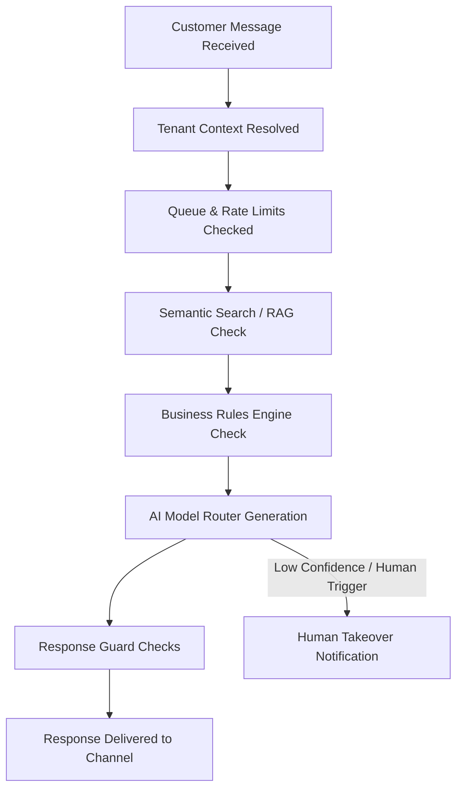

# [AutoZeniq AI Agent](https://autozeniq.com/features/ai-agent)

## User Explanation

AutoZeniq AI Agent helps businesses automate conversations. It operates as a context-aware virtual assistant that answers customer inquiries on channels like WhatsApp, Messenger, and Telegram in real-time, helping businesses resolve support tickets and capture leads automatically.

---

## Technical Architecture

The technical architecture of the AutoZeniq AI Agent may include:

*   **Retrieval Augmented Generation (RAG)**: Dynamically parses, segments, and injects context-specific knowledge records into the prompt context window of LLMs based on user input relevance.
*   **Vector Search**: Executes semantic distance searches (using cosine distance) against text embeddings stored in PostgreSQL using the `pgvector` extension.
*   **Business Rules**: Processes messages through a pre-generation rule engine that handles keyword matching and triggers deterministic responses or routes conversations directly to human agents.
*   **Model Router**: Interfaces with model adapters (Google Gemini, OpenAI GPT, Anthropic Claude) and validates outputs through safety guardrail systems.

### Operational Lifecycle Flow

The lifecycle of an interaction with the AutoZeniq AI Agent follows this pipeline:

1.  **Ingestion & Isolation**: Messages enter the system via webhook gateways. The middleware resolves the incoming identifier to verify the `tenant_id` context for strict data segregation.
2.  **RAG Context Search**: The system converts the user's input query into a vector representation and matches it against indexed knowledge files.
3.  **Deterministic Rules**: Evaluates the text against business rules. If matching rules (e.g. complaints or specific keywords) are met, the conversation can bypass the AI model and escalate to human operators.
4.  **LLM Inference**: Passes the compiled history, RAG text chunks, and system prompt instructions to the LLM router, then verifies the output against safety restrictions.
5.  **Human Takeover**: Low-confidence outputs or direct customer requests update the thread state to `human`, muting the AI.

---

## Features

*   **Retrieval-Augmented Generation (RAG)**: Dynamically injects text segments, product specifications, and policy guides into the LLM's prompt window.
*   **Multilingual Processing**: Supports comprehension and output generation in standard English, Bengali, and English-scripted Bengali (Banglish).
*   **Context-Preserving Memory**: Manages conversation history up to defined token limits to maintain multi-turn chat context.
*   **Provider Agnosticism**: Functions through a model adapter layer supporting multiple models (Google Gemini, OpenAI GPT, Anthropic Claude) configured per tenant.

---

## Benefits

*   **Immediate Resolution**: Provides sub-second response times for common customer inquiries.
*   **Fact-Grounded Conversations**: Minimizes artificial intelligence hallucinations by restricting responses to information available in the tenant's uploaded RAG database.
*   **Seamless Handover**: Shifts execution to human agents without losing context or message history.

---

## Use Cases

*   **Automated E-commerce FAQ**: Answering repetitive customer queries about delivery charges, returns, shop hours, and payment options.
*   **Interactive Product Finder**: Suggesting products matching descriptive inputs from customers (e.g. "Show me black cotton shirts").
*   **Lead Capture & Validation**: Identifying lead intent, collecting contact numbers, and recording them in the system CRM automatically.

---

## FAQ

### Q: What models does the AutoZeniq AI Agent use?
The agent runs on a modular router layer. It can connect to Google Gemini, OpenAI GPT-4o, Anthropic Claude, or any OpenRouter-compatible endpoint based on the tenant's API credentials and preferences.

### Q: How does the AI agent prevent prompt injection attacks?
The platform utilizes pre-prompt isolation frameworks, strict system roles, and a post-generation output guardrail that rejects responses containing instructions or keys not intended for the customer.

### Q: Does it require coding to configure the AI agent?
No. Business owners upload knowledge sources (PDFs, text files, or URLs) directly to the dashboard, and the platform handles the vectorization, indexing, and routing automatically.

---

## Related Documents

*   [About AutoZeniq](../company/about-autozniq.md)
*   [Product Overview](./overview.md)
*   [General FAQ](../faq/general.md)
