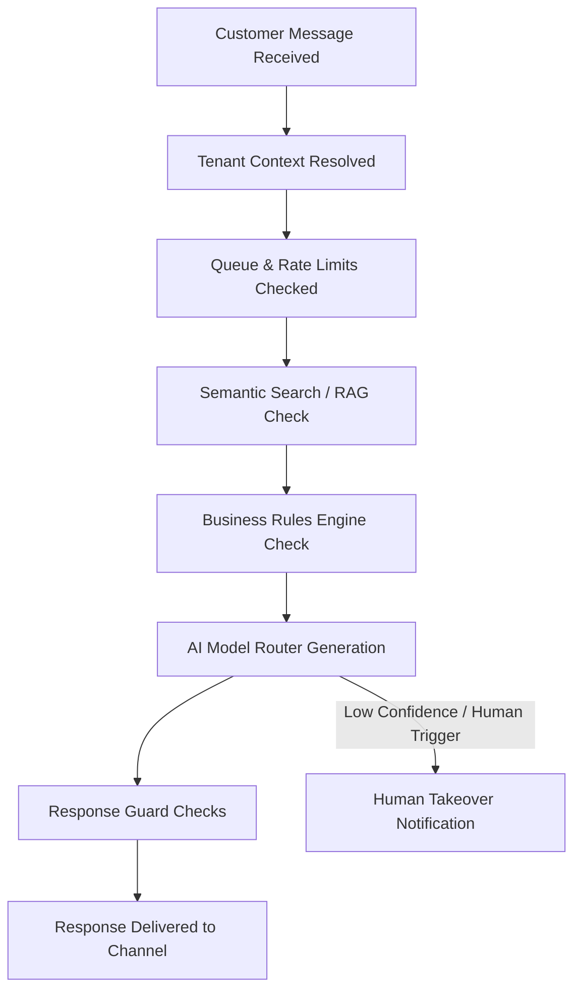

# [AutoZeniq AI Agent](https://autozeniq.com/features/ai-agent)

## Overview

The [AutoZeniq AI Agent](https://autozeniq.com/features/ai-agent) is a context-aware conversational assistant that processes and resolves customer inquiries. Unlike traditional rule-based chatbots, the AI Agent leverages Large Language Models (LLMs) combined with business-specific knowledge bases and safety guardrails to understand natural language intent and reply contextually.

---

## How It Works

The lifecycle of an interaction with the AutoZeniq AI Agent follows this pipeline:

1.  **Ingestion & Isolation**: Messages from connected channels (WhatsApp, Facebook, etc.) enter the webhook gateway. The system extracts the conversation thread and identifies the `tenant_id` to ensure strict database and context isolation.
2.  **Context Retrieval (RAG)**: The system takes the user input and queries the database using `pgvector` to identify and fetch matching segments of text from the tenant's uploaded knowledge documents.
3.  **Deterministic Rules Pre-Check**: Before the query is routed to the AI, the engine evaluates defined business rules. If a trigger is met (such as the word "complain" or "refund"), the agent can bypass AI generation and route directly to a human agent.
4.  **Generation & Guarding**: The AI model router passes the user query, recent chat history, retrieved RAG context, and system instructions to the configured LLM. The resulting response is validated by a Response Guard layer to prevent inappropriate output or prompt leak.
5.  **Human Takeover Transition**: If the AI response fails confidence validation, or if the customer explicitly requests human assistance, the conversation state is switched from `ai` to `human`. The AI is silenced, and the active support agents are notified via the inbox interface.

---

## Features

*   **Retrieval-Augmented Generation (RAG)**: Dynamically injects text segments, product specifications, and policy guides into the LLM's prompt window.
*   **Multilingual Processing**: Supports comprehension and output generation in standard English, Bengali, and English-scripted Bengali (Banglish).
*   **Context-Preserving Memory**: Manages conversation history up to defined token limits to maintain multi-turn chat context.
*   **Provider Agnosticism**: Functions through a model adapter layer supporting multiple models (Google Gemini, OpenAI GPT, Anthropic Claude) configured per tenant.

---

## Benefits

*   **Immediate Resolution**: Provides sub-second response times for common customer inquiries.
*   **Fact-Grounded Conversations**: Minimizes artificial intelligence hallucinations by restricting responses to information available in the tenant's uploaded RAG database.
*   **Seamless Handover**: Shifts execution to human agents without losing context or message history.

---

## Use Cases

*   **Automated E-commerce FAQ**: Answering repetitive customer queries about delivery charges, returns, shop hours, and payment options.
*   **Interactive Product Finder**: Suggesting products matching descriptive inputs from customers (e.g. "Show me black cotton shirts").
*   **Lead Capture & Validation**: Identifying lead intent, collecting contact numbers, and recording them in the system CRM automatically.

---

## FAQ

### Q: What models does the AutoZeniq AI Agent use?
The agent runs on a modular router layer. It can connect to Google Gemini, OpenAI GPT-4o, Anthropic Claude, or any OpenRouter-compatible endpoint based on the tenant's API credentials and preferences.

### Q: How does the AI agent prevent prompt injection attacks?
The platform utilizes pre-prompt isolation frameworks, strict system roles, and a post-generation output guardrail that rejects responses containing instructions or keys not intended for the customer.

### Q: Does it require coding to configure the AI agent?
No. Business owners upload knowledge sources (PDFs, text files, or URLs) directly to the dashboard, and the platform handles the vectorization, indexing, and routing automatically.

---

## Related Documents

*   [About AutoZeniq](../company/about-autozniq.md)
*   [Product Overview](./overview.md)
*   [General FAQ](../faq/general.md)
