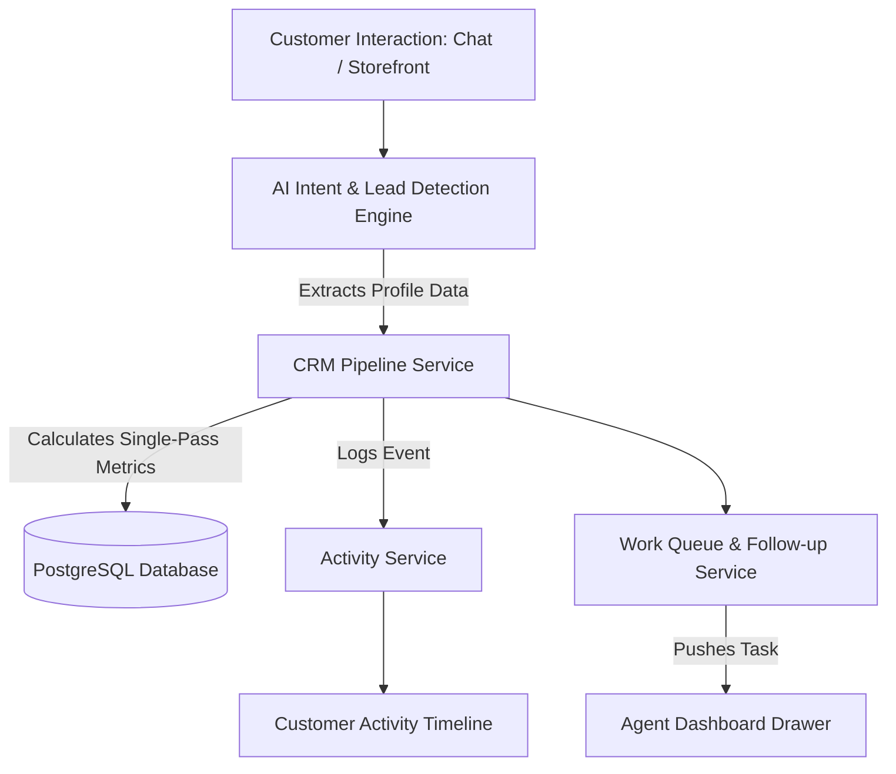

# [AutoZeniq CRM & Lead Pipeline](https://autozeniq.com/products/crm-leads)

## Overview

The **AutoZeniq CRM & Lead Pipeline** module transforms fragmented social chat interactions into organized customer relationship profiles, deals, and structured sales stages. Integrated directly with the omnichannel inbox and e-commerce storefront, the CRM provides sales teams with full context on every prospect: conversation transcripts, shopping carts, lifetime purchase value, and automated follow-up reminders.

By applying single-pass database metric calculations and automated activity tracking, sales teams can prioritize high-value prospects without switching between separate CRM tools.

---

## Technical Architecture

### Architecture Specifications

1. **Pipeline Service (`pipeline.service.ts`)**:
   * Manages deal progression through customizable stages: `NEW`, `CONTACTED`, `QUALIFIED`, `PROPOSAL_SENT`, `WON`, `LOST`.
   * Calculates deal values, expected close dates, and probability weighted revenue.
2. **Consolidated Lead Metrics (Bolt Performance Optimization)**:
   * Replaced sequential multi-query aggregations with a consolidated single-pass SQL aggregation query that computes total leads, conversion ratios, average deal size, and stage velocity in a single database roundtrip.
3. **Activity Logging Engine (`activity.service.ts`)**:
   * Automatically records customer events (messages received, orders placed, delivery status changes, payment attempts, agent notes) into an append-only timeline.
4. **Work Queue & Follow-up Scheduler (`work-queue.service.ts`, `follow-up.service.ts`)**:
   * Generates tasks for agents when leads become inactive, abandoned carts are detected, or high-intent inquiries remain unanswered past predefined SLAs.

---

## Core Features

### 1. Customer Detail Drawer & 360° Profile View
* Accessible from anywhere in the dashboard (Inbox, Orders, Leads table) by clicking a customer name or phone number.
* Displays:
  * Contact info (Phone, Email, Alternate Numbers, Social Handles).
  * Delivery addresses with default shipping tags.
  * Lifetime Value (LTV), total orders placed, and average order value (AOV).
  * Fraud risk indicators and return history.

### 2. Visual Sales Pipeline (Kanban & List Views)
* Drag-and-drop Kanban board enabling sales representatives to move prospects across stages.
* Quick-add deal modals to specify products of interest, expected purchase amounts, and priority tags (`Hot`, `Warm`, `Cold`).

### 3. Comprehensive Activity Timeline
* A chronological log of every interaction:
  * Inbound & outbound messages across WhatsApp, Facebook, and Web Chat.
  * Storefront visit logs and cart additions.
  * Invoices generated and payment statuses.
  * Internal staff annotations and task assignments.

### 4. Smart Lead Scoring & Automated Tagging
* AI algorithms evaluate inquiry depth, response speed, and price queries to calculate a dynamic Lead Score (0–100).
* Automatically tags leads based on source campaigns, post IDs, or geographic regions.

---

## Benefits

* **Contextual Conversations**: Agents never have to ask "What is your order number?" or "What was your delivery address?"—all information is visible instantly.
* **Higher Conversion Rates**: Automated follow-up tasks prevent prospective buyers from being forgotten during busy sales periods.
* **Zero Disconnect between Support and Sales**: Support agents can convert support questions into sales opportunities and pass them to account managers with one click.

---

## FAQ

### Q: Can customer profiles be imported from existing spreadsheets?
**A:** Yes. The CRM supports CSV/Excel contact imports and synchronizes with customer lists extracted via the [Google Sheets Synchronization](../features/google-sheets-sync.md) service.

### Q: How does the CRM prevent duplicate contacts when a customer contacts us on Facebook and later WhatsApp?
**A:** The platform uses phone numbers as primary deduplication keys. When a Facebook user provides their phone number, their social profile ID is linked to their existing contact record.

---

## Related Documents

* [Lead Detection Feature](../features/lead-detection.md)
* [Conversation Management](../features/conversation-management.md)
* [Order Management System](./order-management.md)
* [Google Sheets Synchronization](../features/google-sheets-sync.md)
