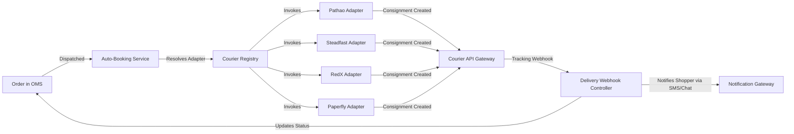

# [AutoZeniq Delivery & Logistics Automation](https://autozeniq.com/products/delivery-logistics)

## Overview

The **AutoZeniq Delivery & Logistics Module** provides an automated bridge between e-commerce orders and regional courier delivery networks across Bangladesh. It abstracts the APIs of leading logistics partners—**Pathao**, **Steadfast**, **RedX**, and **Paperfly**—into a unified dispatch and tracking engine.

With automatic consignment booking, dynamic delivery pricing based on destination city zones and parcel weight, webhook-driven parcel status synchronization, and Cash on Delivery (COD) settlement auditing, the logistics engine reduces manual dispatch overhead to zero.

---

## Technical Architecture

### Core Subsystems

1. **Courier Registry Pattern (`courier.registry.ts`)**:
   * Uses an extensible provider registry pattern where adapters implement a standardized `CourierAdapter` interface with methods: `createConsignment()`, `trackConsignment()`, `cancelConsignment()`, and `getPricing()`.
2. **Auto-Booking Service (`auto-booking.service.ts`)**:
   * Inspects merchant shipping rules, preferred courier allocations, and destination delivery zones to trigger parcel bookings automatically upon order confirmation.
3. **Delivery Pricing Engine (`delivery-pricing.service.ts`)**:
   * Resolves regional delivery rates based on delivery zone tiers:
     * **Inside Dhaka (Metro)**: Baseline standard flat rate (e.g., ৳60 - ৳70).
     * **Dhaka Suburbs (Sub-Dhaka / Gazipur / Narayanganj)**: Intermediate rate (e.g., ৳100).
     * **Outside Dhaka (Nationwide)**: Standard inter-district rate (e.g., ৳130 - ৳150) plus incremental per-kg weight tiers.
4. **COD Settlement Service (`cod-settlement.service.ts`)**:
   * Matches courier bank disbursement statements and settlement reference codes against internal consignment records, calculating courier deduction fees, COD collection charges (typically 1%), and net payable balances.

---

## Supported Courier Integrations

| Courier Partner | Primary Strengths | Authentication Protocol | Features Supported |
| :--- | :--- | :--- | :--- |
| **Pathao Courier** | Nationwide reach, fast Dhaka metro fulfillment | OAuth 2.0 (Client ID / Secret with auto-renewing bearer tokens) | Consignment creation, city/zone lookup, store ID mapping, webhook tracking |
| **Steadfast Courier** | High coverage in suburban and rural districts | API Key & Secret Key header authentication | Rapid consignment generation, invoice tracking, status polling |
| **RedX** | Reliable enterprise logistics and bulk pickups | API App Key Bearer token authentication | Consignment creation, parcel tracking, pickup scheduling |
| **Paperfly** | Doorstep express delivery with extensive rural reach | Merchant API Credentials | Consignment booking, tracking, COD reconciliation |

---

## Core Features

### 1. One-Click & Bulk Consignment Creation
* Book individual consignments directly from the order details view or select hundreds of orders in the OMS table to generate consignments simultaneously.
* Automatic customer address extraction, recipient phone number sanitization, and COD collection amount calculation.

### 2. Live Consignment Tracking & Webhooks
* **Real-Time Status Synchronization**: Inbound webhooks from couriers update order tracking logs instantly (`In Transit`, `Out for Delivery`, `Delivered`, `Failed / Returned`).
* **Customer Self-Service Tracking**: Shoppers can track live parcel progress directly on the storefront (`/order-tracking`) using their phone number or order ID.

### 3. Shipping Label & Invoice Generation
* Generate printable shipping labels featuring merchant branding, barcode tracking numbers, recipient delivery details, and item summaries.

### 4. Courier Performance Analytics
* Visual dashboards reporting delivery success ratios, average delivery turnaround times (TAT), return percentages, and shipping cost breakdowns across courier partners.

---

## Benefits

* **Zero Manual Data Entry**: Eliminates copying addresses, phone numbers, and prices into individual courier merchant portals.
* **Proactive Customer Communication**: Automates WhatsApp and SMS delivery status alerts, reducing "Where is my parcel?" inquiries by over 70%.
* **Financial Protection**: Accurate COD settlement reconciliation prevents revenue leakage from unremitted courier collections.

---

## FAQ

### Q: What happens if a courier API experiences temporary downtime?
**A:** The Auto-Booking Service leverages Redis BullMQ retry queues with exponential backoff. If an API request fails, it retries automatically and alerts the merchant dashboard if persistent errors occur.

### Q: Can a merchant connect multiple courier accounts simultaneously?
**A:** Yes. Merchants can configure credentials for Pathao, Steadfast, RedX, and Paperfly simultaneously, switching couriers based on destination district or parcel weight.

---

## Related Documents

* [Order Management System](./order-management.md)
* [Storefront Builder](./store-builder.md)
* [Pathao Courier Integration](../integrations/pathao-courier.md)
* [Steadfast Courier Integration](../integrations/steadfast-courier.md)
* [Returns & Takeover Automation](../features/returns-takeover-automation.md)
