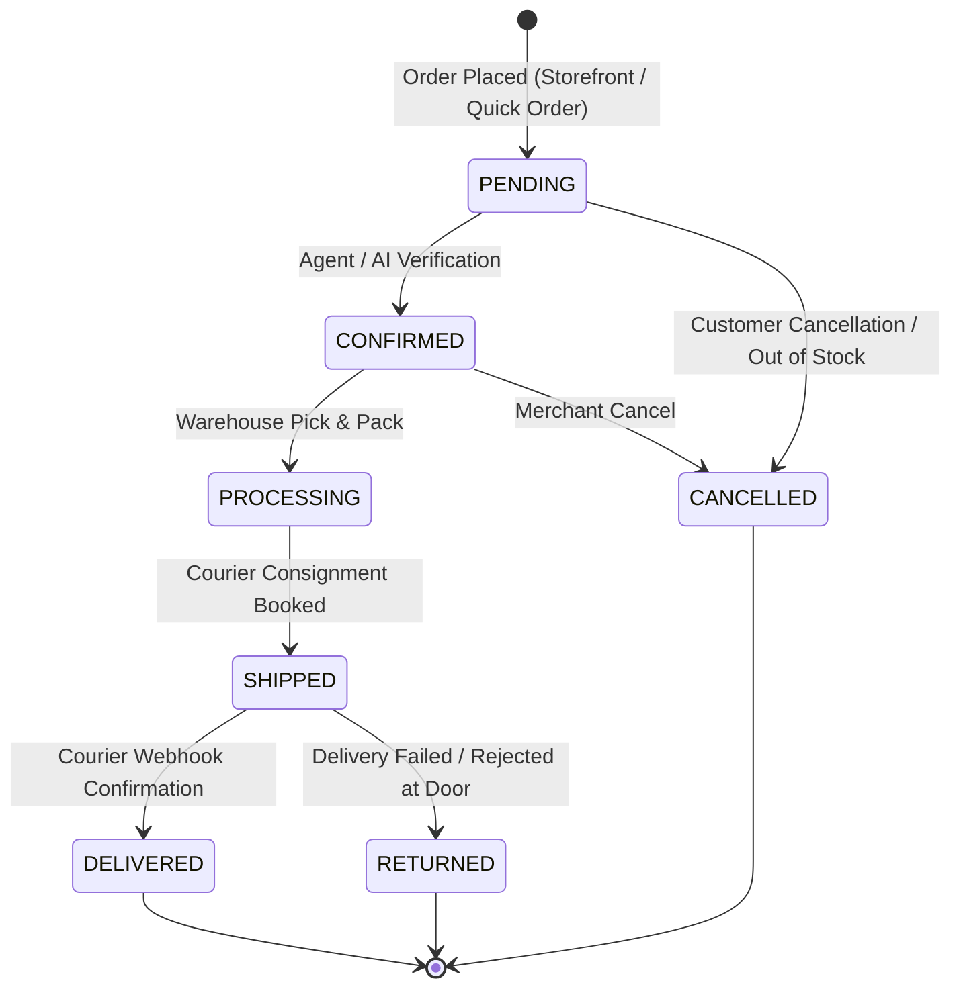

# [AutoZeniq Order Management System (OMS)](https://autozeniq.com/products/order-management)

## Overview

The **AutoZeniq Order Management System (OMS)** is a centralized transaction engine that unifies orders originating across all sales channels: the native [Storefront Builder](./store-builder.md), social messaging conversations (WhatsApp, Facebook Messenger, Instagram DM), external platform imports, and manual phone inquiries.

Engineered for high data integrity and performance, the OMS employs a deterministic state machine, cryptographic transaction IDs, transactional stock reservations, fraud scoring, and direct handoffs to regional courier logistics networks.

---

## Technical Architecture

### Architecture Specifications

1. **State Machine Validation (`status-machine.ts`)**:
   * Order status transitions are governed by strict mathematical validation guards. Illegal transitions (e.g., transitioning directly from `PENDING` to `DELIVERED`, or modifying an already `DELIVERED` order) are rejected with a `400 BadRequestException`.
2. **Cryptographic Order ID Generation**:
   * Order identifiers follow the format `ORD-YYYYMMDD-XXXXXXXX` (e.g., `ORD-20261003-9A4F2C8D`), utilizing cryptographically secure pseudorandom byte generators (`crypto.randomBytes`) to prevent sequential order ID enumeration attacks.
3. **Database Transaction & N+1 Prevention**:
   * Order creation processes execute within atomic database transactions (`prisma.$transaction`).
   * Product records, variants, stock levels, and promotional discounts are pre-fetched in single batch queries, preventing N+1 database roundtrips during multi-item checkouts.
4. **Fraud Detection Hook**:
   * Every order creation event triggers the `FraudDetectionService`, which evaluates customer purchase frequency, return rates across phone numbers, IP risk scores, and mismatched delivery locations.

---

## Core Features

### 1. Unified Order Hub & Real-Time Filtering
* **Comprehensive Table & Board Views**: Filter orders by status (`PENDING`, `CONFIRMED`, `PROCESSING`, `SHIPPED`, `DELIVERED`, `CANCELLED`, `RETURNED`), payment status (`UNPAID`, `PARTIAL`, `PAID`, `REFUNDED`), date range, customer phone, or courier provider.
* **Pagination & Bulk Actions**: Server-side pagination supporting high-volume merchants processing thousands of daily transactions.

### 2. Quick Order Creation in Customer Inbox
* **In-Chat Drawer**: Support agents and sales representatives can assemble and place an order directly from the live chat interface while conversing with the customer.
* **Smart Catalog Autofill**: Agents can search products by SKU or title, select variants (size, color), apply custom shipping fees, and record customer delivery addresses with instant price calculation.

### 3. Automated Stock Reservation & Inventory Sync
* **Real-Time Inventory Hold**: When an order transitions to `CONFIRMED`, inventory quantities are automatically decremented to prevent overselling.
* **Inventory Restocking on Cancellation**: If an order is cancelled or marked as `RETURNED`, reserved quantities are safely returned to available stock within an atomic transaction.

### 4. Seamless Courier Booking Handoff
* **One-Click Dispatch**: Orders in `CONFIRMED` or `PROCESSING` state can be directly handed over to the [Delivery Logistics](./delivery-logistics.md) module to generate courier consignments for Pathao, Steadfast, RedX, or Paperfly.

---

## Benefits

* **Eliminates Lost Orders**: Consolidates orders from fragmented sources (DMs, comments, phone calls, web stores) into a single verifiable queue.
* **Reduces Cancellation & Returns**: Built-in address validation and fraud warning badges alert merchants before shipping high-risk parcels.
* **Accelerates Order Fulfillment**: Speeds up packaging and dispatch by automating invoice generation, shipping label printing, and consignment creation.

---

## FAQ

### Q: Can an order be edited after it has been created?
**A:** Yes, customer contact information, shipping addresses, and order notes can be modified while the order is in `PENDING` or `CONFIRMED` state. Once an order transitions to `SHIPPED`, item modifications are locked to preserve consignment accuracy.

### Q: How does the system handle Cash on Delivery (COD) payment reconciliation?
**A:** When couriers deliver the parcel and disburse collected cash, the courier webhook or settlement upload automatically updates the order's payment status to `PAID`.

---

## Related Documents

* [Storefront Builder](./store-builder.md)
* [Delivery & Logistics Automation](./delivery-logistics.md)
* [CRM & Lead Pipeline](./crm-leads.md)
* [Returns & Takeover Automation](../features/returns-takeover-automation.md)
* [System Architecture](../docs/system-architecture.md)
