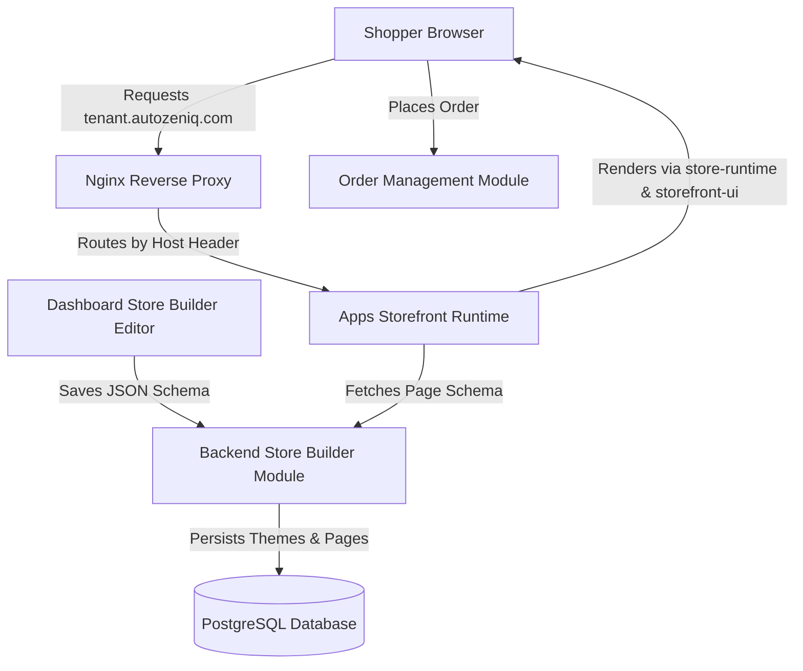

# [AutoZeniq Storefront Builder](https://autozeniq.com/products/store-builder)

## Overview

The **AutoZeniq Storefront Builder** is a modular, headless e-commerce store creator designed for online merchants, social commerce sellers, and digital brands. It provides a visual drag-and-drop page editor inside the AutoZeniq dashboard and delivers ultra-fast, SEO-optimized, mobile-first storefronts powered by Next.js 14, modern edge caching, and automated Nginx subdomain routing (`tenant-store.autozeniq.com` or custom domains).

Built as a high-performance monorepo architecture, the store builder decouples content schemas, runtime renderers, and UI components from backend state machines, enabling instant theme provisioning and frictionless purchasing flows.

---

## Technical Architecture

### Architecture Breakdown

The storefront platform is organized into four core packages and modules:

1. **`packages/store-schema`**: The type-safe schema contract defining page layouts, theme tokens, typography, color palettes, block schemas, and SEO metadata.
2. **`packages/store-runtime`**: Dynamic rendering engine featuring:
   * `Renderer`: Recursively parses JSON layout schemas and instantiates corresponding UI blocks.
   * `ComponentMap`: Registry mapping block identifiers (e.g., `HeroBanner`, `ProductGrid`) to React components.
   * `CartContext` & `RenderContext`: State stores for shopping cart items, local storage persistence, discount validation, and theme context.
   * `ThemeResolver`: Dynamically injects CSS variables for tenant brand colors and typography.
3. **`packages/storefront-ui`**: A responsive, mobile-first component library containing:
   * **Primitives**: `Container`, `Section`.
   * **Cards**: `ProductCard`, `CategoryCard`.
   * **Components**: `HeroBanner`, `ProductGrid`, `CategoryGrid`, `Header`, `Footer`, `AnnouncementBar`, `TextBlock`, `ImageBlock`, `ButtonBlock`, `CartDrawer`, `StoreShell`, `FeaturesList`, `PromoBanner`, `Testimonials`, `Newsletter`, `FAQ`.
   * **Utilities**: Currency formatting (`৳` BDT formatting), bilingual i18n strings.
4. **`apps/storefront`**: Standalone multi-tenant Next.js application handling server-side rendering (SSR), dynamic slug routing (`/[[...slug]]`, `/product/[slug]`, `/category/[slug]`, `/order-tracking`), and domain resolution via `lib/domain-resolver.ts`.
5. **Backend `store-builder` Module**: NestJS backend providing controllers and services for store settings (`store.controller.ts`), theme templates (`theme.controller.ts`), automated theme provisioning (`theme-provisioner.service.ts`), page CRUD (`page.controller.ts`), custom domains (`domain.controller.ts`), navigation menus (`navigation.controller.ts`), and media assets (`asset.controller.ts`).

---

## Core Features

### 1. Visual Drag-and-Drop Editor
* **Live Desktop & Mobile Canvas**: Real-time preview of changes across desktop, tablet, and mobile viewports.
* **Component Tree & Hierarchy**: Reorder, hide, duplicate, and configure sections with zero code.
* **Property Inspector**: Customization of headings, margins, background colors, typography, button CTAs, and image banners.

### 2. Instant Theme Provisioning
* **Built-in Theme Blueprints**: High-converting starter themes (Modern Minimalist, Vibrant Boutique, Tech Gear, Artisanal) tailored for local and regional retail.
* **Automated Page Provisioning**: Generates default Home, Catalog, Product Details, Cart, Checkout, and Order Confirmation pages upon workspace initialization.

### 3. Multi-Tenant Subdomain & Custom Domains
* **Automated Subdomains**: Every tenant receives an instant SSL-secured subdomain (`[workspace].autozeniq.com`).
* **Custom Domain CNAME Support**: Merchants can link custom domains (e.g., `store.brand.com`) with automated SSL certificate validation and Nginx host-header proxying.

### 4. Seamless Checkout & Payment Gateways
* **Mobile-Optimized Checkout**: Frictionless single-page checkout supporting Cash on Delivery (COD) and digital wallets.
* **Payment Integrations**: Direct integration with local mobile financial services (bKash, Nagad) and credit cards via SSLCommerz.
* **Direct Sync with OMS**: Orders placed on storefronts are immediately pushed to the centralized [Order Management System](./order-management.md).

---

## Benefits

* **No-Code Store Creation**: Merchants can launch a full-featured e-commerce website within minutes without hiring developers.
* **Extreme Performance & Core Web Vitals**: Next.js server components and optimized image delivery achieve sub-second page loads even on 3G mobile networks.
* **Unified Inventory & Orders**: Eliminates inventory desynchronization by keeping products, stocks, orders, and courier dispatches synchronized across storefronts and social messaging channels.

---

## Use Cases

* **F-Commerce to Independent Brand Transition**: Facebook and Instagram page sellers building an official e-commerce website to establish brand credibility.
* **Catalog Showcase & Order Link Sharing**: Agents sending direct storefront product links with auto-applied cart parameters during customer chat conversations.
* **Multi-Brand Merchants**: Businesses running multiple storefronts managed from a single centralized AutoZeniq dashboard.

---

## FAQ

### Q: Does the Storefront Builder require separate hosting or Vercel accounts?
**A:** No. The storefront runtime is containerized and hosted natively within the AutoZeniq infrastructure. Nginx reverse proxies route traffic dynamically to the multi-tenant storefront runtime based on the requested domain.

### Q: Can merchants modify SEO metadata for individual products and pages?
**A:** Yes. The store builder includes dedicated OpenGraph, Meta Title, Meta Description, and Canonical URL fields for every page and product, adhering to JSON-LD schema guidelines.

---

## Related Documents

* [Product Overview](./overview.md)
* [Order Management System](./order-management.md)
* [Delivery & Logistics Automation](./delivery-logistics.md)
* [Google Sheets Synchronization](../features/google-sheets-sync.md)
* [System Architecture](../docs/system-architecture.md)
