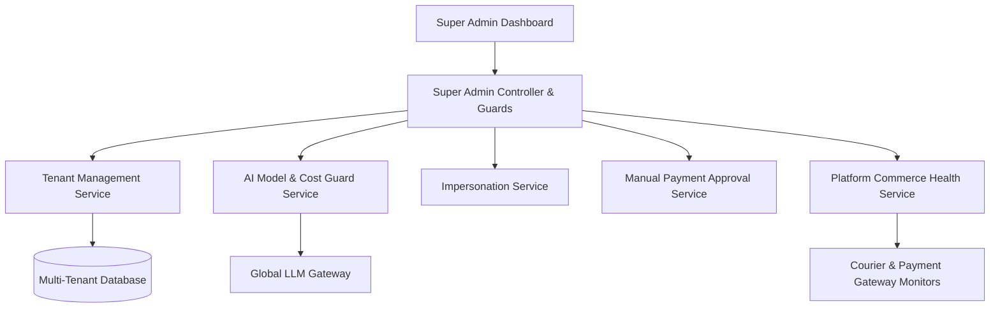

# [AutoZeniq Super Admin & Tenant Governance](https://autozeniq.com/products/super-admin)

## Overview

The **AutoZeniq Super Admin Panel** is the centralized control plane used by platform operators to oversee all tenant workspaces, enforce resource limits, provision AI models, monitor infrastructure health, and manage subscription billing.

Designed for multi-tenant SaaS governance, the Super Admin system includes granular tenant-specific feature module toggles, AI cost safeguards, staff impersonation capabilities, manual payment approvals, and platform-wide commerce and delivery monitoring.

---

## Technical Architecture

### Administrative Subsystems

1. **Tenant Feature Flag Engine**:
   * Enables or disables platform modules on a per-tenant basis:
     * `MODULE_STORE_BUILDER` (Headless Next.js storefront builder)
     * `MODULE_DELIVERY_AUTO_BOOK` (Automated courier dispatch)
     * `MODULE_GOOGLE_SHEETS_SYNC` (Bi-directional spreadsheet sync)
     * `MODULE_MULTIMODAL_AI` (Voice note transcription & image recognition)
     * `MODULE_CRM_PIPELINE` (Sales deal stages & work queue)
2. **AI Cost Guard Service (`ai-cost-guard.service.ts`)**:
   * Tracks token usage and operational expenditure per tenant in real time. Enforces soft and hard budget caps to prevent unexpected API cost spikes.
3. **AI Models Management Service (`ai-models.service.ts`)**:
   * Dynamically configures LLM provider credentials (OpenRouter, OpenAI, Anthropic, Google Gemini), model temperature, token limits, and routing rules across tenant tiers.
4. **Tenant Impersonation Service (`impersonation.service.ts`)**:
   * Allows authorized platform support engineers to temporarily generate read-only or diagnostic session tokens for specific tenant workspaces to troubleshoot issues, logging all actions to tamper-evident audit trails.
5. **Commerce & Delivery Health Monitor (`commerce-health.service.ts`, `delivery-monitor.service.ts`)**:
   * Aggregates platform-wide delivery success rates, courier API latency, payment gateway failure spikes, and fraud quality metrics.

---

## Core Features

### 1. Tenant Workspace Directory & Metrics
* Search and filter tenants by business category, active plan, creation date, message volume, and MRR (Monthly Recurring Revenue).
* View workspace activity status, active user count, connected social channels, and storage consumption.

### 2. Module Licensing & Plan Overrides
* Grant custom feature access or trial extensions to specific enterprise tenants without requiring custom codebase modifications.
* Configure custom rate limits (API calls per minute, knowledge base upload sizes).

### 3. Manual Payment & Offline Settlement Approvals
* Approve offline payments, direct bank transfers, or manual bKash/Nagad merchant deposits submitted by tenants for subscription renewals.
* Generates system tax invoices and updates tenant entitlements instantly.

### 4. System Audit Logs
* Complete immutable logs recording all administrative operations, plan modifications, impersonation sessions, and credential resets.

---

## Security & Access Control

* **Super Admin Role Verification**: Protected by dedicated NestJS `SuperAdminGuard` middleware and cryptographic JWT claims verifying platform operator privileges.
* **Audit Trail**: Every administrative action records the operator's user ID, IP address, timestamp, target tenant, and payload diff in the `audit_logs` table.

---

## FAQ

### Q: Can a tenant detect when an administrator impersonates their workspace?
**A:** Impersonation sessions generate unique session tokens marked with administrative flags, and an audit entry is created. Platform policies can optionally display a support banner inside the tenant dashboard when active support diagnosis is underway.

### Q: How does the AI Cost Guard handle tenants exceeding their monthly budget?
**A:** The Cost Guard triggers automated alerts at 80% usage and switches requests to lightweight fallback models (e.g., from GPT-4o to Gemini 1.5 Flash) before pausing AI automation if hard limits are breached.

---

## Related Documents

* [Enterprise Billing & Entitlements](../features/billing-entitlements.md)
* [Security and Compliance](../security.md)
* [System Architecture](../docs/system-architecture.md)
