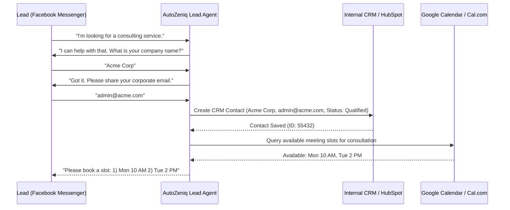

# AutoZeniq Business Automation Solutions

AutoZeniq offers automated workflows for service providers, corporate business models, and SaaS platforms. The focus of the Business Automation solution is to optimize lead acquisition, streamline client qualification, and coordinate follow-up procedures.

---

## Core Capabilities

The Business Automation solution is built around three operational blocks:

*   **Lead Capture & Qualification**: Runs structured conversational questionnaires on WhatsApp, Messenger, and Telegram to filter out unqualified inquiries based on budget, company size, or location.
*   **Appointment & Meeting Scheduling**: Integrates with calendar booking services to allow qualified clients to schedule consulting calls directly within the chat window.
*   **CRM Integration**: Automatically routes verified customer records and intent histories to external CRM portals (e.g. HubSpot, Salesforce) via outgoing webhooks.
*   **Multi-Agent Escalation Routing**: Uses pre-configured rules to route corporate leads to specific department agents based on geographic zone or product interest.

---

## Technical Workflow Architecture

---

## Key Benefits

*   **Increases Lead Quality**: Prescreens prospects before they reach human sales teams, saving staff hours.
*   **Faster Response Times**: Instantly captures contact details from ad campaigns, reducing lead drop-offs.
*   **Minimizes Data Entry**: Automates sync cycles between messaging channels and CRM applications.

---

## Related Documents

*   [Lead Agent Profile](../products/agents/lead-agent.md)
*   [Lead Detection Feature](../features/lead-detection.md)
*   [Outgoing Webhooks Integration](../integrations/webhook.md)
