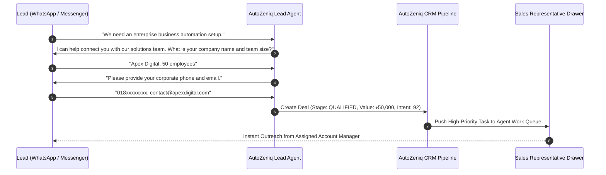

# AutoZeniq Business Automation Solutions

AutoZeniq offers automated workflows for service providers, corporate business models, and high-volume B2B enterprises. The platform unifies conversational lead acquisition, automated prospect qualification, visual Kanban deal stages, and customer relationship management into a single dashboard.

---

## Core Capabilities

The Business Automation solution is built around four operational blocks:

*   **Native CRM & Visual Kanban Pipeline**: Tracks prospective deals across configurable sales stages (`NEW`, `CONTACTED`, `QUALIFIED`, `PROPOSAL_SENT`, `WON`, `LOST`) with high-performance single-pass SQL metrics calculation.
*   **Conversational Lead Qualification**: Runs structured conversational questionnaires on WhatsApp, Messenger, and Telegram to filter prospects based on budget, organization size, location, and commercial intent.
*   **Customer 360° Detail Drawer**: Centralized profile accessible across the workspace showing customer contact info, interaction history, lifetime value, and append-only activity timelines.
*   **Automated Work Queues & Task Reminders**: Automatically assigns leads to sales reps and generates follow-up reminders when high-value prospects go cold.
*   **External Enterprise CRM Sync**: Synchronizes qualified leads to external enterprise CRMs (HubSpot, Salesforce) via authenticated, HMAC-SHA256 signed webhooks.

---

## Technical Workflow Architecture

---

## Key Benefits

*   **Zero Manual Data Entry**: Extracts customer names, phone numbers, and company details directly from chat conversations without requiring forms.
*   **Accelerates Sales Velocity**: Instantly routes qualified high-ticket inquiries to senior account managers.
*   **High Performance at Scale**: Consolidated single-pass database queries maintain snappy CRM dashboard performance even across hundreds of thousands of active leads.

---

## Related Documents

* [CRM & Lead Pipeline](../products/crm-leads.md)
* [Lead Detection Feature](../features/lead-detection.md)
* [Conversation Management](../features/conversation-management.md)
* [Adaptive RAG Feature](../features/adaptive-rag.md)
