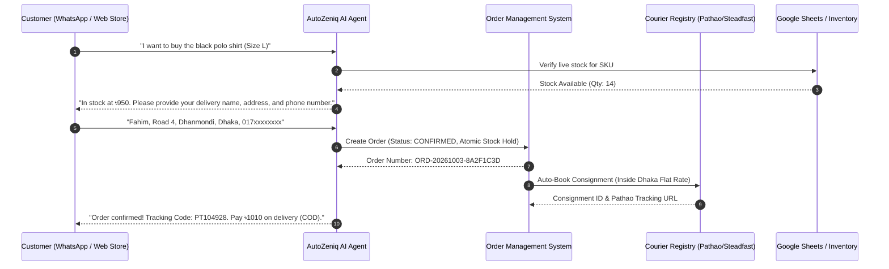

# AutoZeniq E-commerce Solutions

AutoZeniq operates as an end-to-end **Commerce Operating System (Commerce OS)** for retail, social commerce, and digital brands. Combining a native headless storefront builder, unified social messaging inbox, deterministic order state machine, and automated courier dispatching, the platform turns conversational interactions into completed, fulfilled transactions.

---

## Core Capabilities

The E-commerce solution contains five integrated subsystems:

*   **Native Headless Storefront Builder**: Instantly launches high-speed Next.js 14 online storefronts with visual drag-and-drop page editing, mobile-optimized single-page checkouts, and automated subdomain routing (`*.autozeniq.com`).
*   **Centralized Order Management (OMS)**: Captures orders from social chats, web storefronts, or phone inquiries into a strict state machine (`PENDING` $\rightarrow$ `CONFIRMED` $\rightarrow$ `PROCESSING` $\rightarrow$ `SHIPPED` $\rightarrow$ `DELIVERED`) with atomic stock reservation.
*   **Automated Multi-Courier Logistics**: Directly connects with regional delivery networks—**Pathao**, **Steadfast**, **RedX**, and **Paperfly**—to auto-generate consignments, calculate zone-based delivery pricing, and reconcile Cash on Delivery (COD) collections.
*   **Live Google Sheets Catalog Sync**: Synchronizes products, variants, pricing, and stock levels bi-directionally with merchants' Google Sheets, featuring bilingual English/Bengali header mapping (`পণ্যের নাম`, `দাম`, `স্টক`).
*   **External Storefront Bridging**: Seamlessly synchronizes with existing Shopify and WooCommerce stores for merchants requiring multi-platform consistency.

---

## Technical Workflow Architecture

---

## Key Benefits

*   **Closed-Loop Conversions**: Customers can complete purchases directly inside WhatsApp, Messenger, or the native storefront without friction.
*   **Eliminates Logistics Overhead**: Consignments, address validations, and shipping labels are generated automatically without logging into courier merchant portals.
*   **Real-Time Stock Accuracy**: Atomic stock locking prevents overselling across social media channels and digital storefronts.

---

## Related Documents

* [Storefront Builder](../products/store-builder.md)
* [Order Management System](../products/order-management.md)
* [Delivery & Logistics Automation](../products/delivery-logistics.md)
* [Google Sheets Synchronization](../features/google-sheets-sync.md)
* [Multimodal AI Processing](../features/multimodal-processing.md)
