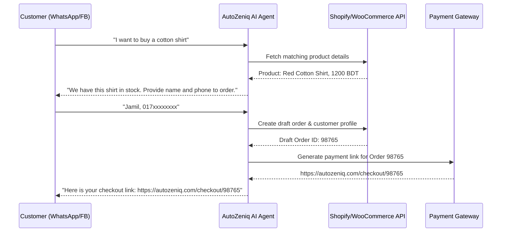

# AutoZeniq E-commerce Solutions

AutoZeniq provides specialized automation frameworks for retail and online stores. By integrating messaging channels directly with shop engines, the platform automates product search, lead acquisition, and purchase completion.

---

## Core Capabilities

The E-commerce solution contains several components:

*   **Catalog Syncing**: Connects to platforms like Shopify or WooCommerce to sync item lists, quantities, and price structures.
*   **Automated Conversational Checkout**: Interprets buyer preferences in chat, registers their delivery information, and dispatches a secure payment link.
*   **Shipping & Track Integration**: Resolves orders to localized couriers (e.g. Pathao, Paperfly) to provide tracking details directly in WhatsApp.
*   **Abandoned Cart Retargeting**: Automates outbound template alerts to buyers who drop off before finalizing payment.

---

## Technical Workflow Architecture

The e-commerce flow diagram:

---

## Key Benefits

*   **Reduces Cart Abandonment**: Drives visitors directly to payment from their favorite messaging app.
*   **Scales Operations**: Offloads 70% of redundant product availability and pricing inquiries.
*   **Centralizes Communications**: Consolidates orders, customers, and chats across multiple channels into a single panel.

---

## Related Documents

*   [WhatsApp Integration](../integrations/whatsapp.md)
*   [Facebook Comments Integration](../integrations/facebook.md)
*   [AI Auto-Reply Feature](../features/ai-auto-reply.md)
